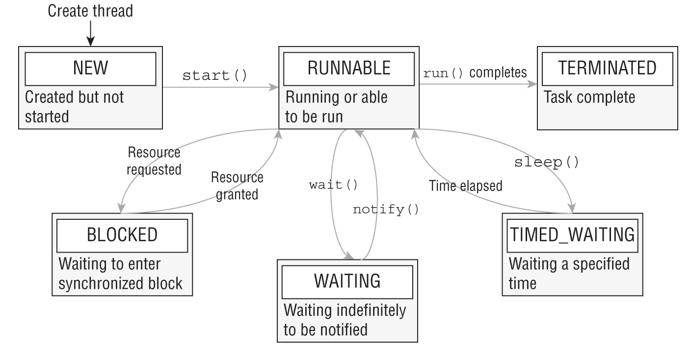
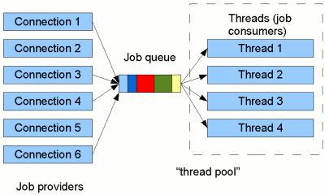

# Előkészítés

## Források

* Core Java
* Oracle Certified Professional Java SE 17 Developer Study Guide
* Java Concurrency in Practice
* Java 2 I-II. - Útikalauz programozóknak 5.0

## Logger

* Slf4J

```xml
<dependency>
    <groupId>org.slf4j</groupId>
    <artifactId>slf4j-simple</artifactId>
    <version>2.0.11</version>
</dependency>
```

* Kiírja a szál nevét

```conf
org.slf4j.simpleLogger.defaultLogLevel = debug
org.slf4j.simpleLogger.showDateTime = true
```

* Indítás óta eltelt ms-ok

## Duration

```java
var hour = 4 * 60 * 60 * 1000;

Duration.ofHours(4).toMillis()
```

# Párhuzamos programozás szálak használatával

## Párhuzamos programozás fogalmai

* Egy alkalmazáson/programon belül feladatok párhuzamos elvégzésére
  * Pl. zenelejátszó alkalmazásban zene lejátszása és lejátszási lista szerkesztése
  * Pl. böngészőben fájlletöltés közben scrollozás, űrlap kitöltése
* _Task_: elvégzendő feladat
* Szálak (_thread_): olyan programozási eszköz, mellyel ez megvalósítható
  * _Multithreading_: szálak párhuzamos futtatásának képessége
* Operációs rendszerbeli folyamat (_process_): egy alkalmazás egy futó példánya
  * Folyamatok egymástól elszigetelt memóriaterületeken dolgoznak
  * A szálakat ezen belül kell elképzelni
  * Szálak megosztják a memóriaterületet egymással
  * _Multitasking_: az operációs rendszer képessége, hogy az alkalmazásokat egymással
  párhuzamosan futtatja

## Egyidejűség és párhuzamosítás

* _Concurrency_ (egyidejűség):
  * A rendszer azon képessége, hogy egy időben képes legyen feladatokat elvégezni
  * Ez történhet időosztással vagy párhuzamosan
  * Ez inkább a tervezésről, felépítésről szól
* _Parallelism_ (párhuzamosítás, nem párhuzamosság):
  * Feladatok elvégzése ténylegesen párhuzamosan
  * Pl. több CPU magon

## Párhuzamos programozás tulajdonságai

* Több processzor(mag)os eszközök, Hyper-Threading processzorok elterjedésével a jelentősége megnőtt, hiszen a hardver jobban kihasználható
* A programozás egy különösen nehéz területe
  * Távolabb áll az emberi gondolkodástól
  * Nem-determinisztikus
* Általában a keretrendszer, amivel dolgozunk leveszi a vállunkról a párhuzamos programozás bonyodalmait

## Hol találkozhatunk vele?

* Szerver alkalmazásoknál, ahol párhuzamosan több felhasználót kell kiszolgálni
* Szerver alkalmazásoknál, ahol valami hosszabb folyamatot kell elindítani (pl. PDF/Excel fájl generálása, kép átméretezése)
* Reszponzív és/vagy szerverrel kommunikáló felhasználói felületeknél
* Ha ez előbbi folyamatok akár meg is szakíthatóak
* Nagy mennyiségű adatok feldolgozásánál

## Párhuzamos programozás Javaban

* Java a párhuzamos programozást több szinten támogatja
* `Thread` osztály és használata a legalacsonyabb szintű, ritkán használt
    * Szinkronizáció: `synchronized`, `wait()`, `notify()`
* Java 5-ben Concurrency API
  * `Executor`, `Callable`, `Future`, stb.
  * Atomic típusok
  * Concurrent collections
  * Szinkronizációs eszközök, pl. `Lock`, `Semaphore`, `CountDownLatch`, `CyclicBarrier`, `Phaser`, stb.
* Java 7
  * Magasabb absztrakció: `ForkJoinPool`
* Java 8 
  * `CompletableFuture` keretrendszer aszinkron feladatok (steps) létrehozására, <br /> kombinálására és futtatására, több, mint 50 metódussal
  * Párhuzamos streamek
* Java 21
  * Virtuális szálak
* Preview fázisban
  * Structured concurrency

## Szálak a Javaban

* Alapból van egy szál, mely a `main()` metódust futtatja
* Vannak további háttérszálak, pl. a szemétgyűjtéshez tartozó szálak
* További szálak indíthatóak

## Thread statikus metódusok: currentThread()

## Thread statikus metódusok: sleep()

## `Runnable` funkcionális interfész

```java
@FunctionalInterface 
public interface Runnable {
	void run();
}
```

* Feladat, melyet egy szálnak át lehet adni

## `Runnable` futtatása `Thread` osztály segítségével

```java
Runnable runnable = () -> {
    for (int i = 0; i < 10; i++) {
        System.out.println(Thread.currentThread().getName() + " " + i);

    }
};
Thread thread = new Thread(runnable);
thread.start();
System.out.println("End");
```

* Szál nevét meg lehet adni konstruktorban, és módosítani is lehet

## Szálak párhuzamosan

```java
for (int j = 0; j < 5; j++) {
    new Thread(runnable).start();
}
```

* Figyelni: a `run()` metódus hívásával nem új szálon történik a végrehajtás

## Kivételkezelés a szálakban

* Szál futása megszakad, nincs kihatása a program további működésére
    * Konzolra kiírásra kerül
* Kivételkezelés
    * `try-catch` alkalmazása a `run()` metóduson belül    
    * `UncaughtExceptionHandler`

(functional interface)

```java
thread.setUncaughtExceptionHandler(
        (t, e) -> log.error("Uncaught exception", e));
```

* Globális `Thread.setDefaultUncaughtExceptionHandler();`

## Szálak használata

* Túl apró műveletek esetén nem hatékony: context switch erőforrásigényes
* Hatékony lehet hosszabb, CPU-t használó műveleteknél
* Amennyiben IO-ra várás van, érdemes használni, hogy a CPU tudjon dolgozni

## `Thread` leszármazott

* Alternatív megoldás: leszármazni a `Thread` osztályból, és override-olni a `run()` metódust
* Megtöri a _prefer composition over inheritance_ elvet

## `Thread` leszármazott implementáció

```java
public class CounterThread extends Thread {

  @Override
  public void run() {
    for (int i = 0; i < 10; i++) {
        System.out.println(Thread.currentThread().getName() + " " + i);

    }
  }

}
```

```java
for (int j = 0; j < 5; j++) {
    new CounterThread().start();
}
```

## Thread Group

* Szálakat lehet összefogni, és egyben kezelni
* Egymásba ágyazhatóak, így fa hierarchiát lehet vele kialakítani
* Legtöbb metódusa már deprecated
* Érdemes helyette valami más mechanizmust alkalmazni, pl. `Executor`, stb.

## Démon szálak

* Leállnak, ha az összes nem démon szál leáll
* `Thread.setDaemon(boolean on)` metódus

## Prioritások

* Értéke 1 - 10, minél nagyobb, annál magasabb a szál prioritása
* `Thread.MIN_PRIORITY`, `Thread.MAX_PRIORITY`
* `Thread.setPriority(int newPriority)`
* Mivel a (natív) szálakat nem a JVM ütemezi, hanem az operációs rendszer, ezért erősen operációs rendszer függő
  * Windows: 
    * Van némi hatása, de nem garantált, hogy a magasabb prioritású előbb fut
    * Nem garantált, hogy a folyamatosan alacsony prioritású sosem fut
  * Linux, macOS:
    * Időosztásos (time-slicing) ütemezés, nem nagyon van hatása
* Éhség (_starvation_)
    * Magasabb prioritásúak elvehetik a CPU időt az alacsonyabb prioritásúaktól
    * Vannak ez ellen mechanizmusok az operációs rendszerek ütemezőjében
* Best practice: nem érdemes rá építeni

## ThreadLocal

A ThreadLocal érdekessége, hogy úgy működik, hogy a `Thread` osztályban van egy
`ThreadLocal.ThreadLocalMap threadLocals` attribútum, mely a Thread-ben a
ThreadLocal-hoz tárolja egy map adatszerkezetben az értéket.

# Ütemezés Timer használatával

## Timer

https://www.baeldung.com/java-timer-and-timertask

Egyszeri vagy ismétlődő feladatok ütemezésére.

* `TimerTask` - amit el kell végezni
* `Timer` - scheduler, ütemező

```java
@SneakyThrows
public static void main(String[] args) {
    var task = new TimerTask() {
        public void run() {
            log.info("Send e-mails");
        }
    };

    var timer = new Timer();

    timer.schedule(task, Duration.ofSeconds(1).toMillis());
    log.info("Scheduled");

    Thread.sleep(Duration.ofSeconds(5).toMillis());

    timer.cancel();
}
```

* Minden `TimerTask` példányhoz egy saját background szál. Nem daemon thread, így
fenntarthatja a JVM futását. Ezplicit leállításhoz `cancel()` metódus.
* `abstract class TimerTask implements Runnable`
* `schedule(TimerTask task, long delay)`
    * `Date` paraméterrel is
* `cancel()` gracefully


## Ismétlődés

* Fixed delay - az előző végrehajtás idejéhez képest, ha az késett, akkor a következő is fog
  * `schedule(TimerTask task, long delay, long period)` overloadolt metódusok
    * `Date` paraméterrel is
  * Task lehetőleg fusson le hamar, mert az ütemező szálon fut. Neve `Timer-0`.
  * Késleltetés (delay): ha a task futásideje hosszabb, mint a `period`
  * Ha a futásideje hosszú, de még belefér a `period` értékébe, akkor nem lesz késleltetés
Fixed rate - függetlenül az előző végrehajtás késlekedésétől
  * `scheduleAtFixedRate()` metódusok, ismétlésre

* Következő futás lekérdezhető a taskból a `scheduledExecutionTime()` metódussal

## Leállítás

* `TimerTask` `cancel()` metódusával leállítható a teljes ütemező


## Kivételkezelés

* Nem kezelt kivétel esetén leáll a timer végrehajtása

* Kiváltja a Java 5-ben bevezetett `ScheduledThreadPoolExecutor`
    * Nem érzékeny a rendszerórára
    * Több szálon is képes futni
    * Exception után futtatja a következő taskot

# Versenyhelyzet és szálbiztosság

## Versenyhelyzet és szálbiztosság fogalmak 

* Megosztott erőforrás (_shared resource_): két vagy több szál egyszerre akar hozzáférni (írás és/vagy olvasás)
* Versenyhelyzet (_race condition_): a lefutás eredménye attól függ, hogy a szálak lépései milyen sorrendben kerülnek végrehajtásra, melyik szál ér oda először, az eredmény megjósolhatatlan és gyakran hibás
    * *A versenyhelyzet egy párhuzamos programozási probléma, egy hiba*
* Kritikus szakasz: (_critical section_): az a kódrészlet, ahol race condition keletkezhet
* Ki kell küszöbölni:
    * Egyszerre egy szál futtathassa a kritikus szakaszt
* Szálbiztos (_thread safe_): többszálas környezetben is az elvártnak megfelelően működik, ugyanazt az eredményt hozza, mint egy szál esetén
* Attól, hogy egy osztály szálbiztos, még lehet vele kapcsolatban versenyhelyzet

## Szálak és változók

* Ugyanazt a metódust futtathatja párhuzamosan több szál is
* Mindegyik szál saját veremmel rendelkezik
* Azaz a lokális változókból saját másolattal rendelkezik
* Nincs ez így az attribútumokkal, hiszen azok a heapen helyezkednek el

## Szálbiztosság - Read-Modify-Write

* Példa a _Read-Modify-Write_ versenyhelyzetre

```java
public class Main {

    private int counter = 0;

    private void incrementAndReport() {
        System.out.println(++counter);
    }

    public static void main(String[] args) {
        ExecutorService service = Executors.newFixedThreadPool(2);
        Main main = new Main();
        for (int i = 0; i < 2; i++) {
            service.submit(main::incrementAndReport);
        }
    }
}
```

Szinkronizációs mechanizmusok:

* Lock vagy más néven _mutex_ (mutual exclusion - kölcsönös kizárás)
  * Lock acquire and release
* Monitor: magas szintű absztrakció
* Guarded block, condition: egy szál várakoztatása addig, amíg egy feltétel nem teljesül
* Semaphore: limitálni a szálak számát

Javaban:

* Nyelvi és alacsony szintű megoldások: 
    * Monitor
    * Mindegyik objektumhoz tartozik egy object level lock, ún. intrinsic lock (vagy monitor lock)
    * Hozzáférni a `synchronized`, `Object` `wait()`, `notify()`, `notifyAll()` metódusokkal lehet
    * Guarded block: előző eszközök kombinálásával
* Osztálykönyvtárbeli megoldások: Synchronizers in Java Standard Library elemei a `java.util.concurrent` csomagban
    * pl. `Lock` interfész fejlettebb lock kezelésre
    * `Lock` és `Condition` használatával, rugalmasabb, mint a guarded block, több, különálló feltétel esetén

Főbb különbségek:

`Lock` esetén:

*  Rugalmasabb, explicit hívások, metódus paraméterként átadható
* `Lock` esetén próbálkozás a lock megszerzésére: blokkolás nélkül megvizsgálja, hogy szabad-e a lock
*  Lockra várakozás megszakítható

## Szinkronizált metódus

```java
private synchronized void incrementAndReport() {
    System.out.println(++counter);
}
```

* Statikus metódus esetén lock az osztályon

## Szinkronizált blokk

```java
private void incrementAndReport() {
    synchronized(this) {
    	System.out.println(++counter);
    }
}
```

Van, hogy egy külön objektumot hozunk létre, melyen lockolni lehet: "ad hoc lock"
Van, hogy tudjuk, hogy egy objektum osztályának metódusai lockoltak, és erre az objektumra lockolunk: "client-side lock" - nagyon körültekintően, csak ha ismerjük az osztály pontos működését

## Példa: kávéautomata

```java
class CoffeeMachine {
    public void makeCoffee(String customerName) {
        synchronized (this) {
            System.out.println(customerName + " is using the coffee machine.");
            try {
                Thread.sleep(2000); // Simulate making coffee
            } catch (InterruptedException e) {
                e.printStackTrace();
            }
            System.out.println(customerName + " finished making coffee.");
        }
    }
}

class CustomerThread extends Thread {
    private CoffeeMachine coffeeMachine;
    private String customerName;

    public CustomerThread(CoffeeMachine coffeeMachine, String customerName) {
        this.coffeeMachine = coffeeMachine;
        this.customerName = customerName;
    }

    @Override
    public void run() {
        coffeeMachine.makeCoffee(customerName);
    }
}

public class ObjectLevelLockExample {
    public static void main(String[] args) {
        CoffeeMachine coffeeMachine = new CoffeeMachine();

        // Create multiple customer threads trying to use the coffee machine
        for (int i = 1; i <= 3; i++) {
            CustomerThread customerThread = new CustomerThread(coffeeMachine, "Customer " + i);
            customerThread.start();
        }
    }
}
```

## Reentrancy

* Egy szál (thread) ismételten beléphet egy kritikus szekcióba vagy zárolt kódrészletbe anélkül, hogy holtpontba kerülne.
* Java-ban minden zárolás egy számlálóval van társítva. Ha egy szál belép egy reentrant zárolt blokkjába, a számláló nő. A szál kilépésekor a számláló csökken, és amikor eléri a nullát, a zárolás felszabadul.

Fontos:

* Egymást hívják a synchronized metódusok
* Önmagát hívja, rekurzió

```java
public class ReentrantExample {

    public synchronized void methodA() {
        System.out.println("Method A started");
        methodB();  // A synchronized methodA hívja a synchronized methodB-t
        System.out.println("Method A ended");
    }

    public synchronized void methodB() {
        System.out.println("Method B");
    }

    public static void main(String[] args) {
        ReentrantExample example = new ReentrantExample();

        // Egy szál hívja meg methodA-t
        new Thread(example::methodA).start();
    }
}
```

## Szálbiztosság - Check-Then-Act

* Példa a _Check-Then-Act_ race conditionre

```java
public class Main {

List<Integer> numbers = new ArrayList<>();

    public void addIfAbsent(int n) {
        if (!numbers.contains(n)) {
            numbers.add(n);
        }
    }

    public static void main(String[] args) throws InterruptedException {
        ExecutorService service = Executors.newFixedThreadPool(2);
        Main simple = new Main();
        for (int i = 0; i < 2; i++) {
            service.submit(() -> simple.addIfAbsent(10));
        }
    }
}
```

## Guarded block, wait, notify

```java
public class GuardedBlockExample {
    private boolean condition = false;

    public synchronized void guardedMethod() throws InterruptedException {
        // Addig várunk, amíg a feltétel nem igaz
        while (!condition) {
            wait();  // Várakozás a feltétel teljesüléséig
        }
        // Kritikus szakasz, amely csak akkor fut, ha a feltétel igaz
        System.out.println("Condition is met, proceeding...");
    }

    public synchronized void signal() {
        condition = true;
        notify();  // Értesítjük az egyik várakozó szálat
    }
}
```

https://www.baeldung.com/java-wait-notify

## join() metódus

https://www.baeldung.com/java-thread-join

```java
class SampleThread extends Thread {
    public int processingCount = 0;

    SampleThread(int processingCount) {
        this.processingCount = processingCount;
        LOGGER.info("Thread Created");
    }

    @Override
    public void run() {
        LOGGER.info("Thread " + this.getName() + " started");
        while (processingCount > 0) {
            try {
                Thread.sleep(1000);
            } catch (InterruptedException e) {
                LOGGER.info("Thread " + this.getName() + " interrupted");
            }
            processingCount--;
            LOGGER.info("Inside Thread " + this.getName() + ", processingCount = " + processingCount);
        }
        LOGGER.info("Thread " + this.getName() + " exiting");
    }
}

@Test
public void givenStartedThread_whenJoinCalled_waitsTillCompletion() 
  throws InterruptedException {
    Thread t2 = new SampleThread(1);
    t2.start();
    LOGGER.info("Invoking join");
    t2.join();
    LOGGER.info("Returned from join");
    assertFalse(t2.isAlive());
}
```

Timeout

* `t3.join(1000);`


## Liveness

* _Liveness__: elvégzi a feladatát, attól függetlenül, hogy párhuzamos szálak vannak, és vannak kódrészletek,
melyek párhuzamosan nem futtathatóak
* _Liveness problémák_:
    * Olyan problémák, melyek megakadályozzák, hogy a szálak előrelépést érjenek el. Beragadnak, vagy végtelen várakozásba kerülnek.
    * Ezeket kell eliminálni

## Liveness problémák

* _Deadlock_: egymásra várnak a szálak, két szál, két erőforrás
  * Valós példa: egymást előreengedik az ajtóban
  * Megoldás: megfelelő sorrendezéssel, timeoutok használatával
* _Livelock_: a szálak egymással kommunikálnak ahelyett, hogy a munkájuk végeznék (nincsenek blokkolt állapotban)
  * Valós példa: szűk folyósón merre kerüljék ki egymást, telefonon egymást hívják
  * Megoldás: a szálak csak egy bizonyos számú próbálkozás után hagynak fel a kísérletekkel, vagy véletlenszerű várakozás újrapróbálkozás előtt
* _Resource contention_:
  * Ugyanarra a szűkös erőforrásra várnak
  * Megoldás: jobb erőforrás elosztás, pl. használat idejének csökkentése, hozzáférés korlátozás vagy sharding
* _Starvation_: egy szál nem fér hozzá megosztott erőforráshoz, ezért akadályozva van a munkájában
  * Másik szál foglalja CPU-t sokáig
  * Megoldás: _fairness_ (méltányosság)

https://www.baeldung.com/java-deadlock-livelock

## Deadlock

```java
public class Friend {

    private final String name;

    public Friend(String name) {
        this.name = name;
    }
    public String getName() {
        return this.name;
    }
    public synchronized void bow(Friend bower) {
        System.out.format("%s: %s has bowed to me!%n",
                this.name, bower.getName());
        bower.bowBack(this);
    }
    public synchronized void bowBack(Friend bower) {
        System.out.format("%s: %s has bowed back to me!%n",
                this.name, bower.getName());
    }
}
```

Main:

```java
Friend alphonse = new Friend("Alphonse");
Friend gaston = new Friend("Gaston");

Thread t1 = new Thread(() -> alphonse.bow(gaston));
Thread t2 = new Thread(() -> gaston.bow(alphonse));
t1.start();
t2.start();
```

## Thread dump

* Fényképezőgép ikon
* Copy to clipboard
* _Code / Analyze Stack Trace or Thread Dump_ menüpont

https://www.baeldung.com/java-thread-dump

```shell
jps
jstack 1234
```

```plain
Found one Java-level deadlock:
=============================
"Thread-0":
  waiting to lock monitor 0x00000246ddf0c560 (object 0x00000005b949a288, a deadlock.Friend),
  which is held by "Thread-1"

"Thread-1":
  waiting to lock monitor 0x00000246ddffa050 (object 0x00000005b949a248, a deadlock.Friend),
  which is held by "Thread-0"

Java stack information for the threads listed above:
===================================================
"Thread-0":
        at deadlock.Friend.bowBack(Friend.java:19)
        - waiting to lock <0x00000005b949a288> (a deadlock.Friend)
        at deadlock.Friend.bow(Friend.java:16)
        - locked <0x00000005b949a248> (a deadlock.Friend)
        at deadlock.FriendMain.lambda$main$0(FriendMain.java:9)
        at deadlock.FriendMain$$Lambda/0x000002468b003420.run(Unknown Source)
        at java.lang.Thread.runWith(java.base@21.0.1/Thread.java:1596)
        at java.lang.Thread.run(java.base@21.0.1/Thread.java:1583)
"Thread-1":
        at deadlock.Friend.bowBack(Friend.java:19)
        - waiting to lock <0x00000005b949a248> (a deadlock.Friend)
        at deadlock.Friend.bow(Friend.java:16)
        - locked <0x00000005b949a288> (a deadlock.Friend)
        at deadlock.FriendMain.lambda$main$1(FriendMain.java:10)
        at deadlock.FriendMain$$Lambda/0x000002468b003640.run(Unknown Source)
        at java.lang.Thread.runWith(java.base@21.0.1/Thread.java:1596)
        at java.lang.Thread.run(java.base@21.0.1/Thread.java:1583)

Found 1 deadlock.
```

## Livelock

Akkor fordulhat elő, ha szálak túl előzékenyek egymással.

Ebben a példában két karakter (pl. két ember) próbál kikerülni egymás útjából. Ha az egyik azt látja, hogy a másik is mozogni próbál, akkor mindketten megpróbálnak újra elmozdulni, de végül soha nem haladnak előre, mert folyamatosan alkalmazkodnak a másik mozgásához.

```java
class Character {
    private boolean moveAllowed = false;

    // Azért szinkronizált, hogy a szálak hozzáférése vezérelt legyen
    public synchronized void allowMove() {
        this.moveAllowed = true;
    }

    public synchronized void disallowMove() {
        this.moveAllowed = false;
    }

    public synchronized boolean canMove() {
        return moveAllowed;
    }
}

class LivelockSimulation {

    public static void main(String[] args) {
        Character character1 = new Character();
        Character character2 = new Character();

        // Runnable 1: Az első karakter próbál elmozdulni
        Runnable task1 = () -> {
            while (!Thread.currentThread().isInterrupted()) {
                if (character1.canMove()) {
                    System.out.println("Karakter 1 mozogni próbál, de látja, hogy Karakter 2 is mozog.");
                    character1.disallowMove();  // Karakter 1 megáll, hogy engedje a másikat
                    character2.allowMove();     // Karakter 2-nek enged mozogni
                }
            }
        };

        // Runnable 2: A második karakter próbál elmozdulni
        Runnable task2 = () -> {
            while (!Thread.currentThread().isInterrupted()) {
                if (character2.canMove()) {
                    System.out.println("Karakter 2 mozogni próbál, de látja, hogy Karakter 1 is mozog.");
                    character2.disallowMove();  // Karakter 2 megáll, hogy engedje a másikat
                    character1.allowMove();     // Karakter 1-nek enged mozogni
                }
            }
        };

        // Indítsuk el mindkét karakter szálát
        Thread thread1 = new Thread(task1);
        Thread thread2 = new Thread(task2);

        // Az egyik karakter kezdi a mozgást
        character1.allowMove();  // Kezdetben Karakter 1 mozoghat

        thread1.start();
        thread2.start();
    }
}
```

## Starvation

Operációs rendszer ütemezőjének sajátosságai miatt nehezen demonstrálható.

* Prioritások
* `yield()`

```java
public class Starvation {

    public static void main(String[] args) {

        final Object lock = new Object();  // Közös zárolás

        // Alacsony prioritású szál
        Thread lowPriorityThread = new Thread(() -> {
            synchronized (lock) {
                System.out.println("Alacsony prioritású szál megszerezte a zárolást.");
                try {
                    Thread.sleep(5000);  // Az alacsony prioritású szál dolgozik
                } catch (InterruptedException e) {
                    e.printStackTrace();
                }
                System.out.println("Alacsony prioritású szál befejezte a munkát.");
            }
        });

        // Magas prioritású szálak
        Runnable highPriorityTask = () -> {
            while (true) {
                synchronized (lock) {  // Magas prioritású szálak is megszerzik a zárolást
                    System.out.println(Thread.currentThread().getName() + " megszerezte a zárolást.");
                    try {
                        Thread.sleep(50);  // Magas prioritású szál rövid ideig használja az erőforrást
                    } catch (InterruptedException e) {
                        e.printStackTrace();
                    }
                }
                // Engedjük más szálak futását rövid ideig, mielőtt újra próbálkozunk
                Thread.yield();
            }
        };

        Thread highPriorityThread1 = new Thread(highPriorityTask, "Magas prioritású szál 1");
        Thread highPriorityThread2 = new Thread(highPriorityTask, "Magas prioritású szál 2");
        Thread highPriorityThread3 = new Thread(highPriorityTask, "Magas prioritású szál 3");

        // Szálak beállítása prioritás alapján
        lowPriorityThread.setPriority(Thread.MIN_PRIORITY);  // Legalacsonyabb prioritás
        highPriorityThread1.setPriority(Thread.MAX_PRIORITY);  // Legmagasabb prioritás
        highPriorityThread2.setPriority(Thread.MAX_PRIORITY);  // Legmagasabb prioritás
        highPriorityThread3.setPriority(Thread.MAX_PRIORITY);  // Legmagasabb prioritás

        // Indítsuk el a szálakat
        highPriorityThread1.start();
        highPriorityThread2.start();
        highPriorityThread3.start();
        lowPriorityThread.start();
    }
}
```

## Felfüggesztés

* `Thread.suspend()`, `Thread.resume()` 1.2 óta deprecated
* `throw new UnsupportedOperationException();`

## Leállítás

* `Thread.stop()` Java 1.2 óta deprecated

## Megszakítás és leállítás

* Brian Goetz

```java
class PrimeProducer extends Thread {
    private final BlockingQueue<BigInteger> queue;

    PrimeProducer(BlockingQueue<BigInteger> queue) {
        this.queue = queue;
    }

    public void run() {
        try {
            BigInteger p = BigInteger.ONE;
            while (!Thread.currentThread().isInterrupted()) {
                queue.put(p = p.nextProbablePrime()); // blocking operation
            }
        } catch (InterruptedException consumed) {
            // allow thread to exit
        }
        // any code here will still be executed
    }

    public void cancel() {
        interrupt();
    }
}
```

## Szálak állapotai



## volatile

A volatile kulcsszó a Java-ban arra szolgál, hogy jelezze a JVM-nek (Java Virtual Machine), hogy egy változó értéke a memória minden szál által olvasható és írható változójában mindig friss legyen. Ez biztosítja, hogy egy változót, amelyet több szál is használ, minden szál közvetlenül a fő memóriából olvasson és írjon, ne egy szál-specifikus gyorsítótárból.

https://www.baeldung.com/java-volatile

Mikor használjuk a volatile-t?

* Olyan változókon, amelyeket több szál is módosíthat, és biztosítani kell, hogy minden szál lássa a legfrissebb értéket.
* Amikor elkerüljük a bonyolult szinkronizációs mechanizmusokat (mint a synchronized), de mégis garantálni akarjuk a láthatóságot több szál között.
* Olyan esetekben, amikor egy változót csak egy szál ír, de több szál olvassa (például egy kész jelzőnél, amely megmondja, hogy egy feladat befejeződött-e).

```java
public class VolatileExample {
    private static volatile boolean flag = false;

    public static void main(String[] args) {
        // Szál, amely figyeli a flag változót
        Thread readerThread = new Thread(() -> {
            while (!flag) {
                // Várakozás, amíg flag igaz nem lesz
            }
            System.out.println("Flag értéke megváltozott: " + flag);
        });

        // Szál, amely megváltoztatja a flag értékét
        Thread writerThread = new Thread(() -> {
            try {
                Thread.sleep(1000);  // Egy másodpercet vár, mielőtt módosítja a változót
            } catch (InterruptedException e) {
                e.printStackTrace();
            }
            flag = true;
            System.out.println("Flag beállítva igazra.");
        });

        readerThread.start();
        writerThread.start();
    }
}
```

A `volatile` csak a változók láthatóságát garantálja.
__A `volatile` nem garantálja a műveletek atomosságát.__ Ha például egy változó növelésére használjuk (x++), az nem lesz atomi művelet, mert az olvasás és írás különálló lépések. Ilyen esetekben synchronized-ot vagy más szinkronizációs mechanizmust kell használni.

## Immutable classes

## Nem szálbiztos osztályok használata

```java
public class Main {

    private static DateFormat dateFormat = new SimpleDateFormat("yyyy-MM-dd");

    public void parseDate() {
        try {
            System.out.println(dateFormat.parse("2017-10-26"));
        } catch (ParseException e) {
            e.printStackTrace();
        }
    }

    public static void main(String[] args) {
	// ...
            for (int i=0; i<100; i++) {
                service.submit(main::parseDate);
			}
	// ...
    }
}
```

Klasszikus nem szálbiztos osztályok: `StringBuilder`, `SimpleDateFormat`, Database connections, `ArrayList`, stb.

## StringBuilder és StringBuffer

* `StringBuffer` régebbi, szinkronizált

## Singleton

* enum v. keretrendszer
* Effective Java

```java
public class SafeSingleton {
    private static SafeSingleton instance;

    private SafeSingleton() {
        // Privát konstruktor
    }

    public static synchronized SafeSingleton getInstance() {
        if (instance == null) {
            instance = new SafeSingleton();
        }
        return instance;
    }
}
```

Lassú, mert minden példány lekérés sorba van állítva, pedig akkor már nem kéne, mikor létrejött.

Gyorsabb a Double-Checked Locking használatával.

```java
public class DoubleCheckedLockingSingleton {
    private static volatile DoubleCheckedLockingSingleton instance;

    private DoubleCheckedLockingSingleton() {
        // Privát konstruktor
    }

    public static DoubleCheckedLockingSingleton getInstance() {
        if (instance == null) {
            synchronized (DoubleCheckedLockingSingleton.class) {
                if (instance == null) {
                    instance = new DoubleCheckedLockingSingleton();
                }
            }
        }
        return instance;
    }
}
```

Figyeljük meg, hogy az `instance` `volatile`.

## ThreadLocalRandom

https://www.baeldung.com/java-thread-local-random

Java 7

* `Random` thread-safe, azonban párhuzamos környezetben performancia problémák jelentkezhetnek a lock miatt
* Helyette inkább `ThreadLocalRandom`
* Nem támogatja a seed beállítását

```java
int boundedRandomValue = ThreadLocalRandom.current().nextInt(0, 100);
```

## Példa: Polling

### Változás figyelése dátum ellenőrzésével

* Daemon szál, hogy alkalmazás leállásakor ez is leálljon

```java
package nativefilechange;

import lombok.AllArgsConstructor;
import lombok.SneakyThrows;
import lombok.extern.slf4j.Slf4j;

import java.io.IOException;
import java.nio.file.Files;
import java.nio.file.Path;
import java.time.Duration;
import java.util.function.Consumer;

@Slf4j
public class WatchDog implements Runnable {

    private Path path;

    private Duration delay;

    private Consumer<Path> consumer;

    private long lastModified;

    @SneakyThrows
    public WatchDog(Path path, Duration delay, Consumer<Path> consumer) {
        this.path = path;
        this.delay = delay;
        this.consumer = consumer;
        lastModified = -1;
    }

    @Override
    @SneakyThrows
    public void run() {
        lastModified = Files.getLastModifiedTime(path).toMillis();
        while (!Thread.interrupted()) {
            try {
                var actual = Files.getLastModifiedTime(path).toMillis();
                log.info("Last modified: {} {}", lastModified, actual);
                if (lastModified < actual) {
                    consumer.accept(path);
                    lastModified = actual;
                }
                Thread.sleep(delay.toMillis());
            } catch (InterruptedException e) {
                break;
            }
        }
    }

}
```

```java
@SneakyThrows
public static void main(String[] args) {
    WatchDog watchDog = new WatchDog(Path.of("test.txt"),
            Duration.ofSeconds(1),
            p -> log.info("changed"));
    Thread watchDogThread = new Thread(watchDog);
    watchDogThread.start();
    Thread.sleep(Duration.ofSeconds(5));
    watchDogThread.interrupt();
}
```

### Változás figyelése WatchService használatával

```java
@Slf4j
public class WatchDog implements Runnable {

    private Path path;

    private Consumer<WatchEvent<?>> consumer;

    public WatchDog(Path path, Consumer<WatchEvent<?>> consumer) {
        this.path = path;
        this.consumer = consumer;
    }

    @Override
    @SneakyThrows
    public void run() {
        try (WatchService watchService = FileSystems.getDefault().newWatchService()) {
            path.register(watchService, ENTRY_CREATE, ENTRY_MODIFY, ENTRY_DELETE);

            // Végtelen ciklus az események figyelésére
            while (Thread.interrupted()) {
                WatchKey key;
                try {
                    // Várakozás az eseményekre
                    log.info("Waiting...");
                    key = watchService.take();
                    log.info("Key: {}", key);
                } catch (InterruptedException e) {
                    return;
                }

                // Események feldolgozása
                for (WatchEvent<?> event : key.pollEvents()) {
                    consumer.accept(event);
                }

                // A kulcs visszaállítása, hogy újabb eseményeket fogadhasson
                boolean valid = key.reset();
                if (!valid) {
                    break;
                }
            }
        }

    }

}
```

```java
@SneakyThrows
public static void main(String[] args) {
    var watchDog = new Thread(new WatchDog(Path.of("."),
    e -> log.info("Event: {} {}", e.context(), e.kind())
            ));
//        watchDog.setDaemon(true);
    watchDog.start();
    Thread.sleep(5000);
    watchDog.interrupt();
}
```

### Http HealthCheck

## Példa: Termelő-fogyasztó probléma wait és notify használatával

Producer-Consumer, más néven bounded-buffer

* Producer: Elemeket ad a tárolóhoz. Ha a tároló megtelt, a producer várakozik, amíg a consumer elemeket nem vesz ki belőle.
* Consumer: Elemeket vesz ki a tárolóból. Ha a tároló üres, a consumer várakozik, amíg a producer elemeket nem ad hozzá.

Több probléma is jelentkezik:

* Egyszerre kell hozzáférni a termékeket tartalmazó sorhoz
* A termelés és fogyasztás üteme eltérő lehet
* Egyszerre több termelő, egyszerre több fogyasztó

```java
import java.util.LinkedList;
import java.util.Queue;

class ProducerConsumerManual {
    private final Queue<Integer> buffer = new LinkedList<>();
    private final int LIMIT = 5;

    public void produce() throws InterruptedException {
        int value = 0;
        while (true) {
            synchronized (this) {
                while (buffer.size() == LIMIT) {
                    wait();  // Várakozik, ha a buffer megtelt
                }
                buffer.add(value++);
                System.out.println("Produced: " + value);
                notify();  // Értesíti a consumer szálat
                Thread.sleep(100);  // Szimulált termelési idő
            }
        }
    }

    public void consume() throws InterruptedException {
        while (true) {
            synchronized (this) {
                while (buffer.isEmpty()) {
                    wait();  // Várakozik, ha a buffer üres
                }
                int value = buffer.poll();
                System.out.println("Consumed: " + value);
                notify();  // Értesíti a producer szálat
                Thread.sleep(150);  // Szimulált fogyasztási idő
            }
        }
    }

    public static void main(String[] args) {
        ProducerConsumerManual pc = new ProducerConsumerManual();

        Thread producerThread = new Thread(() -> {
            try {
                pc.produce();
            } catch (InterruptedException e) {
                Thread.currentThread().interrupt();
            }
        });

        Thread consumerThread = new Thread(() -> {
            try {
                pc.consume();
            } catch (InterruptedException e) {
                Thread.currentThread().interrupt();
            }
        });

        producerThread.start();
        consumerThread.start();
    }
}
```

## Példa: Ebédelő filozófusok probléma

Dining Philosophers

https://www.baeldung.com/java-dining-philoshophers

* Probléma: N filozófus körben ül, és evőpálcikákat használnak az étkezéshez. Minden filozófusnak két pálcikára van szüksége, de csak egyet vehet fel egyszerre. A probléma akkor adódik, ha minden filozófus egyszerre akar enni, deadlock. Egyik megoldás, ha egy filozófus fordított sorrendben veszi fel a pálcikákat.
* Dijkstra, 1965-ben

https://hu.wikipedia.org/wiki/Edsger_Wybe_Dijkstra

* Dijkstra-algoritmus, amit irányított vagy irányítás nélküli gráfokban egy kitüntetett csúcsból induló legrövidebb utak megkeresésére lehet használni
* Szemaforok bevezetése a szálak szinkronizálásához
* Strukturált programozás: szekvencia, a feltételes elágazás (szelekció) és a feltételes ciklus (iteráció vagy véges ismétlés)
    * Tanulmányt készített arról, hogy miért nem szabad goto utasításokat használni

```java
public class Philosopher implements Runnable {

   // Member variables, methods defined earlier

    @Override
    public void run() {
        try {
            while (true) {
                
                // thinking
                doAction(System.nanoTime() + ": Thinking");
                synchronized (leftFork) {
                    doAction(
                      System.nanoTime() 
                        + ": Picked up left fork");
                    synchronized (rightFork) {
                        // eating
                        doAction(
                          System.nanoTime() 
                            + ": Picked up right fork - eating"); 
                        
                        doAction(
                          System.nanoTime() 
                            + ": Put down right fork");
                    }
                    
                    // Back to thinking
                    doAction(
                      System.nanoTime() 
                        + ": Put down left fork. Back to thinking");
                }
            }
        } catch (InterruptedException e) {
            Thread.currentThread().interrupt();
            return;
        }
    }
}
```

```java
public static void main(String[] args) throws Exception {

    Philosopher[] philosophers = new Philosopher[5];
    Object[] forks = new Object[philosophers.length];

    for (int i = 0; i < forks.length; i++) {
        forks[i] = new Object();
    }

    for (int i = 0; i < philosophers.length; i++) {
        Object leftFork = forks[i];
        Object rightFork = forks[(i + 1) % forks.length];

        philosophers[i] = new Philosopher(leftFork, rightFork);
        
        Thread t 
            = new Thread(philosophers[i], "Philosopher " + (i + 1));
        t.start();
    }
}
```

Deadlock, megoldása:

```java
if (i == philosophers.length - 1) {    
    // The last philosopher picks up the right fork first
    philosophers[i] = new Philosopher(rightFork, leftFork); 
} else {
    philosophers[i] = new Philosopher(leftFork, rightFork);
}
```

# Tesztelés Awaitility használatával

## Awaitility

http://www.awaitility.org/

https://www.baeldung.com/awaitility-testing

```xml
<dependency>
    <groupId>org.awaitility</groupId>
    <artifactId>awaitility</artifactId>
    <version>4.2.2</version>
    <scope>test</scope>
</dependency>
```

# Java Microbenchmark Harness (JMH)

https://www.baeldung.com/java-microbenchmark-harness

# Executor

## `ExecutorService`

* Java 5 Concurrency API vezette be
* Szálak létrehozására és futtatására
* Szálak létrehozása erőforrásigényes, költséges
  * Nem használt szálakat egy poolban tartjuk
  * Szálakat újrafelhasználjuk
  * Feladatokat egy sorba gyűjti, majd osztja ki a szálaknak
* Plusz funkciók, mint thread pool és ütemezés

## Osztályak és interfészek

* `ExecutorService` interfész, `ThreadPoolExecutor` általános implementáció
* `Executors` osztályban factory metódusok a leggyakrabban használt esetekre
* Paraméterként feladatokat kap (command, ha nincs vissztérési értéke, task, ha van)

## Pool

```java
ExecutorService service = Executors.newFixedThreadPool(2);
Runnable command = () -> System.out.println(IntStream.rangeClosed(1, 5).sum());
service.execute(command);
```

* `newFixedThreadPool()`: szálak száma állandó
* `newCachedThreadPool()`: engedi nőni a szálak számát, de a nem használtakat egy idő után kidobja

## Shutdown

* `shutdown()` metódus hívandó, mert indít egy nem démon szálat (ezért nem áll le a JVM)
* A szálakat végigfuttatja, új szálat már nem fogad be (`RejectedExecutionException`)
* `isShutdown()` és `isTerminated()` metódusok

## Egyszálú executor

```java
ExecutorService service = Executors.newSingleThreadExecutor();
service.execute(command); // implements Runnable
```

* Egy szálon futtatja sorrendben a `Runnable` implementációkat
* Használható pl. tesztelésre

## Feladatok átadása

```java
Callable<Integer> task = () -> IntStream.rangeClosed(1, 5).sum();
Future<Integer> result = executorService.submit(task);
```
* `V call() throws Exception` metódus, deklarál kivételt

## `Future`

* `get()` - eredmény lekérése, blokkoló hívás, kivételt dob, ha szálon belül kivétel történt
* `get(long timeout, TimeUnit unit)` - eredmény lekérése, blokkoló, timeouttal, kivételt dob, ha szálon belül kivétel történt
* `isDone()` - akár eredménnyel, akár kivétellel, akár megszakítással
* `cancel(boolean mayInterruptIfRunning)` - megszakítást küld
* `isCancelled()` - megszakítással fejeződött be

## Várakozás a feladatokra

https://www.baeldung.com/java-executor-wait-for-threads

* `awaitTermination(long timeout, TimeUnit unit)` metódus

## Egyszerre több feladat átadása

* `invokeAll()`
  * `Callable` collection a paramétere
  * Megvárja az összeset
  * `List<Future>` a visszatérési értéke
* `invokeAny()`
  * `Callable` collection a paramétere
  * Bevárja az elsőt
  * Visszatérési értéke a kiszámolt eredmény

## `ScheduledExecutorService`

```java
ScheduledExecutorService service = Executors.newSingleThreadScheduledExecutor();
	// vagy	newScheduledThreadPool(int nThreads)
Future<Integer> result = executorService.schedule(callable, 10, TimeUnit.SECONDS);
```

* Bizonyos idő múlva
* Bizonyos idő múlva, bizonyos időközönként ismételve

## Kivételek kezelése

* Elnyeli
* `Runnable` esetén elkérhető az `afterExecute(Runnable r, Throwable t)` hook metódussal
* `Callable` esetén a `Future.get()` `ExecutionException` kivételt dob, annak `getCause()`
	metódusával elkérhető a kivétel

## Megszakítás

* `Future` `cancel(boolean mayInterruptIfRunning)` metódusa, paramétere, hogy interruptot küldjön-e
  * `true` esetén pl. a `sleep()` hívást megszakítja: `InterruptedException`
* A `Thread.currentThread().isInterrupted()` hívással lekérdezhető
* `Future`-től lekérdezhető, `isCancelled()`

## Queuing és saturation policies

https://www.baeldung.com/java-rejectedexecutionhandler#4-queueing

https://www.baeldung.com/java-rejectedexecutionhandler#saturation-policies

## Példa: Client-server

```java
@Slf4j
public class SimpleHttpServer {
    public static void main(String[] args) {
        int port = 8080;  // A webserver portja

        ExecutorService executorService = Executors.newFixedThreadPool(4);

        try (ServerSocket serverSocket = new ServerSocket(port)) {
            log.info("Server is listening on port {}", port);

            while (true) {
                Socket socket = serverSocket.accept();  // Várakozás a kliens kapcsolatra
                executorService.submit(new ClientHandler(socket));
                log.info("New client connected");
            }
        } catch (IOException ex) {
            log.error("Error running server", ex);
        }
    }
}
```

```java
@Slf4j
public class ClientHandler implements Runnable {
    private final Socket socket;

    public ClientHandler(Socket socket) {
        this.socket = socket;
    }

    @Override
    public void run() {
        try (InputStream input = socket.getInputStream();
             BufferedReader reader = new BufferedReader(new InputStreamReader(input));
             OutputStream output = socket.getOutputStream();
             PrintWriter writer = new PrintWriter(output, true)) {

            // Olvassuk be az első sort (HTTP kérés fejlécét)
            String line = reader.readLine();
            if (line != null && line.startsWith("GET")) {
                // HTTP válasz felépítése
                String response = """
                        HTTP/1.1 200 OK
                        Content-Type: text/html
                        Content-Length: 46

                        <html><body><h1>Hello, World!</h1></body></html>
                        """;

                writer.println(response);  // Küldjük a választ
            }

        } catch (IOException ex) {
            System.out.println("Server exception: " + ex.getMessage());
            ex.printStackTrace();
        } finally {
            // Kapcsolat lezárása
            try {
                socket.close();
            } catch (IOException ex) {
                log.error("Can not close", ex);
            }
            System.out.println("Client connection closed.");

        }
    }
}
```

# Atomic osztályok

## Atomic osztályok

* Több művelet atomi, oszthatatlan: más szál nem szakíthatja meg
* `AtomicBoolean`, `AtomicInteger`, `AtomicIntegerArray`, `AtomicLong`, `AtomicLongArray`, `AtomicReference`, `AtomicReferenceArray`, `AtomicMarkableReference`
* Nem monitoros lockolás van (`synchronized`), ezért hatékonyabb tud lenni
    * Használhat natív, hardverközeli megoldást

## Atomic metódusok

* `get()`
* `set()`
* `getAndSet()`
* `incrementAndGet()`
* `getAndIncrement()`
* `decrementAndGet()`
* `getAndDecrement()`

## Atomic megoldás

```java
public class Main {

    private AtomicInteger counter = new AtomicInteger();

    private void incrementAndReport() {
        System.out.println(counter.incrementAndGet());
    }

    public static void main(String[] args) {
        ExecutorService service = null;
        try {
            service = Executors.newFixedThreadPool(20);
            Main main = new Main();
            for (int i=0; i<10; i++) {
                service.submit(main::incrementAndReport);
            }
        } finally {
            if(service != null) service.shutdown();
        }
    }
}
```

## Set és lazySet

https://www.baeldung.com/java-atomic-set-vs-lazyset

* `set()` metódus hívása megfelel annak, mintha `volatile` változót írnánk, a változás azonnal látható a másik szál számára
* `lazySet()` metódus hívása esetén előfordulhat, hogy a másik thread egy korábbi értéket lát
    * Performancia növelés, de körültekintően kell használni

## Újabb metódusok

1.8 óta

```java
public static AtomicLong largest = new AtomicLong();
largest.set(Math.max(largest.get(), observed)); // Nem szálbiztos
```

helyett

```java
largest.updateAndGet(x -> Math.max(x, observed));
```

vagy

```java
largest.accumulateAndGet(observed, Math::max);
```

## Non-blocking data structures

https://www.baeldung.com/lock-free-programming

* Adatstruktúrák párhuzamos használata lock használatával stravation
* Különböző fajtái:
    * Obstruction-Free
    * Lock-Free
    * Wait-Free

Implementálásához kell valamilyen mechanizmus a lockon kívül:

* _Compare-and-swap_ (CAS): csak akkor cseréli az értéket, ha a régi megfelel egy elvárt értékkel (azaz nem változott)
    * Atominak, ez az optimistic lock, és hatékonyabb, mint a lockolás
    * Lock-Free algoritmusok, adatstruktúrák implementálhatóak vele

## `AtomicReference`

* Szálbiztos referencia módosítás
* Immutable objektumok frissítése
* Lock-free algoritmusokban

```java
import java.util.concurrent.atomic.AtomicReference;

class Counter {
    private int count;

    public Counter(int initialCount) {
        this.count = initialCount;
    }

    public int getCount() {
        return count;
    }

    public void increment() {
        count++;
    }
}

public class AtomicReferenceExample {
    public static void main(String[] args) {
        AtomicReference<Counter> atomicCounter = new AtomicReference<>(new Counter(0));

        // Több szál egyszerre növeli a számlálót
        Runnable task = () -> {
            for (int i = 0; i < 1000; i++) {
                // CAS (Compare-And-Set) ciklus
                while (true) {
                    Counter oldCounter = atomicCounter.get();
                    Counter newCounter = new Counter(oldCounter.getCount());
                    newCounter.increment();
                    if (atomicCounter.compareAndSet(oldCounter, newCounter)) {
                        break;  // Kilépés, ha a frissítés sikeres volt
                    }
                }
            }
        };

        Thread t1 = new Thread(task);
        Thread t2 = new Thread(task);

        t1.start();
        t2.start();

        try {
            t1.join();
            t2.join();
        } catch (InterruptedException e) {
            e.printStackTrace();
        }

        System.out.println("Final count: " + atomicCounter.get().getCount());
    }
}
```

Immutable esetben:

```java
public record UserProfile(String name, int age) {

    public UserProfile incrementAge() {
        return new UserProfile(name, age + 1);
    }
}
```

```java
public class AtomicReferenceExample {
    public static void main(String[] args) throws InterruptedException {
        // Immutable UserProfile inicializálása
        UserProfile initialProfile = new UserProfile("John Doe", 30);
        AtomicReference<UserProfile> atomicProfile = new AtomicReference<>(initialProfile);

        // Két szálat indítunk, amelyek megpróbálják frissíteni a profilt
        Runnable updateTask = () -> {
            for (int i = 0; i < 50; i++) {
                while(true) {
                    UserProfile oldProfile = atomicProfile.get();
                    UserProfile newProfile = oldProfile.incrementAge();

                    // CAS (Compare-And-Set) ciklus: új objektumra frissítjük az atomic referenciát
                    boolean updated = atomicProfile.compareAndSet(oldProfile, newProfile);
                    if (updated) {
                        System.out.println(Thread.currentThread().getName() + " updated profile to: " + newProfile);
                        break;
                    } else {
                        System.out.println(Thread.currentThread().getName() + " failed to update profile.");
                    }

                    try {
                        Thread.sleep(100); // Kisebb várakozás a szálak közötti verseny szimulálására
                    } catch (InterruptedException e) {
                        Thread.currentThread().interrupt();
                    }
                }
            }
        };

        ExecutorService executor = Executors.newFixedThreadPool(4);
        executor.submit(updateTask);
        executor.submit(updateTask);

        executor.shutdown();
        executor.awaitTermination(1, TimeUnit.MINUTES);

        // A végső profil kiíratása
        System.out.println("Final profile: " + atomicProfile.get());
    }
}
```

## `AtomicMarkableReference`

https://www.baeldung.com/java-atomicmarkablereference

* Javaban nincs tuple, mert félő, hogy túl gyakran használnák speciális osztály létrehozása helyett
* `AtomicMarkableReference` egy objektum és egy `boolean` (_mark_) kezelése együtt atomi módon
* Használható:
    * Optimista zárolás (CAS - Compare-And-Swap) implementációjához:
        * Ha egy objektum módosításainak nyomon követésére van szükség, és azt is szeretnéd tudni, hogy az objektumot valaki más módosította-e, anélkül hogy explicit zárolást használnál. Az compareAndSet() metódus segítségével egyszerre hasonlíthatod össze és módosíthatod az objektumot és a hozzá tartozó jelölőt.
    * Például lock-free (zármentes) adatstruktúrákban, mint a lock-free linked list, csak jelölik, hogy egy elem törlésre került-e

```java
import java.util.concurrent.atomic.AtomicMarkableReference;

class Node<T> {
    T value;
    AtomicMarkableReference<Node<T>> next;

    Node(T value, Node<T> next) {
        this.value = value;
        this.next = new AtomicMarkableReference<>(next, false);  // False jelzi, hogy a csomópont nincs törlés alatt
    }
}

public class LockFreeList<T> {
    private final Node<T> head;

    public LockFreeList() {
        head = new Node<>(null, null);  // Dummy head node
    }

    public boolean insert(T value) {
        Node<T> newNode = new Node<>(value, null);
        Node<T> pred, curr;
        boolean[] marked = {false};

        while (true) {
            pred = head;
            curr = pred.next.getReference();

            while (curr != null) {
                Node<T> succ = curr.next.get(marked);
                if (marked[0]) {
                    // Az aktuális csomópont törlés alatt van, próbáljuk eltávolítani
                    if (!pred.next.compareAndSet(curr, succ, false, false)) {
                        continue;  // Valaki más eltávolította, próbáljuk újra
                    }
                    curr = succ;
                } else {
                    pred = curr;
                    curr = succ;
                }
            }

            newNode.next.set(pred.next.getReference(), false);
            if (pred.next.compareAndSet(pred.next.getReference(), newNode, false, false)) {
                return true;
            }
        }
    }
}
```


## `LongAdder` és `LongAccumulator` osztályok

1.8 óta

* `AtomicLong` helyett
* `LongAdder` összeadásra
* `LongAccumulator` egyéb műveletekre
    * `LongAdder` így implementálható: `new LongAccumulator((x, y) -> x + y, 0L)`
* Túl sok szál okozta teljesítménycsökkenés esetén

```java
LongAccumulator adder = new LongAccumulator(Long::sum, 0);
adder.accumulate(value);
```

* `Short`, `Integer`, `Long`, `Float` és `Double` osztályoknak statikus `sum`, `max` és
`min` metódusok, melyek használhatóak method reference-ként

# Szálbiztos kollekciók

## Műveletek kollekciókkal

* Probléma egy metódus hívásával
* Probléma több metódus hívásával

## Elavult osztályok

Szinkronizáltak

* `Vector`
    * `implements List`
    * JavaDoc: nem szinkronizált esetben `ArrayList`
* `Stack`
    * `extends Vector`
    * JavaDoc: "a more complete and consistent set of LIFO stack operations is provided by the Deque interface and its implementations, which should be used in preference to this class"
* `Hashtable`
    * `implements Map`
    * JavaDoc: nem szinkronizált esetben `HashMap`
    * JavaDoc: szinkronizált esetben `ConcurrentHashMap`

## Szálbiztos burkolók

* `Collections` osztály `synchronizedXXX()` metódusai
* Nézetek
* Bejárást, több metódushívást tartalmazó műveleteket nekünk kell szálbiztossá tennünk

## Szálbiztos kollekciók

[LinkedBlockingQueue vs ConcurrentLinkedQueue](https://www.baeldung.com/java-queue-linkedblocking-concurrentlinked)

* Bizonyos esetekben hatékonyabbak, mint a burkolók
* `CopyOnWriteArraySet`, `CopyOnWriteArrayList`
	* Mindig lemásolja az eredeti adatszerkezetet
    * Bejárás esetén egy konzisztens pillanatképet látnak a listáról
    * Egyszerre több iterátor is lehet
    * Kis elemszám esetén érdemes alkalmazni
* `ConcurrentHashMap`
    * Méret növekedésével nincs hatékonyságbeli romlás
    * Egy elemen végzett műveletek atomiak
    * Sok új metódus a `Map` interfészhez képest
    * Aggregált műveletek, pl. a `putAll()` vagy `clear()` nem atomi
* `ConcurrentLinkedQueue`, `ConcurrentLinkedDeque`
    * Nincs méretbeli korlátozása
* `SynchronousQueue`
    * Implementálja a `BlockingQueue` interfészt, mely további blokkoló metódusokat definiál
    * Nincs belső tárolója, a `put()` metódus addig blokkolódik, míg valaki ki nem veszi a `take()` metódussal
* `ArrayBlockingQueue`
    * Korlátos méretű átmeneti tárolót használ
* `LinkedBlockingQueue`, `LinkedBlockingDeque`
	* Ha nincs nincs megadva kapacitás korlát, akkor csak a `take()` metódus blokkolódik
    * Ha kapacitás korlát meg van adva a konstruktorban, akkor a `put()` metódus is blokkolódik
* `DelayQueue`
    * Az elemeknek meg kell valósítania a `Delayed` interfészt
    * Ez azt mondja meg, hogy minimálisan mennyit kell várakoznia a sorban
    * Ha több kivehető elem van, akkor a legrégebben lejártat adja vissza
    * Ha egy sincs, akkor a `take()` metódus hívása blokkol
* `PriorityBlockingQueue`
    * Az elemeknek rendezhetőnek kell lennie, és a legnagyobb elemet adja vissza
* `ConcurrentSkipListSet`, `ConcurrentSkipListMap`    
	* Rendezettség miatt tovább optimalizált

## Skiplist

* Lehetővé teszi a gyors keresést, beillesztést és törlést rendezett elemek halmazában
* Több rétegben tartalmaz linkeket, így a lista bizonyos elemei "átugorhatók"
     (átlagosan minden második, negyedik, nyolcadik elem van belinkelve)
* Gyakori beszúrás és törlés esetén

## ConcurrentHashMap

### `ConcurrentHashMap` újdonságok

* `putIfAbsent`, `compute`, `computeIfAbsent`, `merge` metódusok szálbiztosak
* Három fajta művelet:
  * `search`: keresés
  * `reduce`: összes elem alapján egy értéket állít elő
  * `forEach`: minden elemre végrehajtja

### Metódusok formái

* Négy verziója:
  * `xxxKeys`: csak a kulcsokon
  * `xxxValues`: csak az értékeken
  * `xxx`: kulcs és érték párokon
  * `xxxEntries`: `Map.Entry` objektumokon
* `threshold` paraméter: mennyinél indítson új szálat

### `search` metódusok

```java
String result = map.search(threshold, (k, v) -> v > 1000 ? k : null);
```

### `forEach` metódusok

```java
map.forEach(threshold,
  (k, v) -> System.out.println(k + " -> " + v));
```

```java
map.forEach(threshold,
  (k, v) -> k + " -> " + v, // Transformer
  System.out::println); // Consumer
```

```java
map.forEach(threshold,
  (k, v) -> v > 1000 ? k + " -> " + v : null, // Szűri a null elemeket
    System.out::println);
```

### `reduce` metódusok

```java
Long sum = map.reduceValues(threshold, Long::sum);
```

```java
Integer maxlength = map.reduceKeys(threshold,
  String::length, // Transformer
  Integer::max); // Accumulator
```

```java
Long count = map.reduceValues(threshold,
  v -> v > 1000 ? 1L : null, // Null értékeket szűri
  Long::sum);
```

`ToInt`, `ToLong` és `ToDouble` posztfixekkel

### `Set` view

* Nincs concurrent hash set, ezért csak egy view

```java
Set<String> words = ConcurrentHashMap.<String>newKeySet();
```

```java
Set<String> words = map.keySet(1L);
```

## `Arrays` párhuzamos műveletek

* `parallelSort` metódus, rendezés
* `parallelSetAll` metódus, elemek előállítása index alapján

```java
Arrays.parallelSetAll(values, i -> i % 10);
```

* `Arrays.parallelPrefix` kombinálás az előző elemekkel

```java
int[] i = {1, 1, 2, 2, 3, 3};
Arrays.parallelPrefix(i, (x, y) -> x + y ); // i = [1, 2, 4, 6, 9, 12]
```

## Példa: Termelő-fogyasztó probléma BlockingQueue használatával

```java
import java.util.concurrent.ArrayBlockingQueue;
import java.util.concurrent.BlockingQueue;

// Producer osztály
class Producer implements Runnable {
    private final BlockingQueue<Integer> queue;

    public Producer(BlockingQueue<Integer> queue) {
        this.queue = queue;
    }

    @Override
    public void run() {
        try {
            for (int i = 1; i <= 10; i++) {
                System.out.println("Produced: " + i);
                queue.put(i);  // Elem hozzáadása a tárolóhoz
                Thread.sleep(100);  // Szimulált termelési idő
            }
        } catch (InterruptedException e) {
            Thread.currentThread().interrupt();
        }
    }
}

// Consumer osztály
class Consumer implements Runnable {
    private final BlockingQueue<Integer> queue;

    public Consumer(BlockingQueue<Integer> queue) {
        this.queue = queue;
    }

    @Override
    public void run() {
        try {
            while (true) {
                Integer value = queue.take();  // Elem kivétele a tárolóból
                System.out.println("Consumed: " + value);
                Thread.sleep(150);  // Szimulált fogyasztási idő
            }
        } catch (InterruptedException e) {
            Thread.currentThread().interrupt();
        }
    }
}

public class ProducerConsumerExample {
    public static void main(String[] args) {
        // BlockingQueue létrehozása
        BlockingQueue<Integer> queue = new ArrayBlockingQueue<>(5);  // Mérete: 5

        // Producer és Consumer szálak indítása
        Thread producerThread = new Thread(new Producer(queue));
        Thread consumerThread = new Thread(new Consumer(queue));

        producerThread.start();
        consumerThread.start();
    }
}
```

https://www.baeldung.com/java-read-write-files-different-threads

# Lock

## Lock interfész

https://www.baeldung.com/java-concurrent-locks

Monitor további implementációi

* Fejlettebb, mint a `synchronized` blokk
    * Paraméterként továbbadható, nem kell egy metóduson belül lennie
    * _fairness_: legrégebb óta váró szál férhet hozzá a lockhoz
    * `tryLock()` metódus, csak akkor lockol, ha lehetséges
    * A lockra váró szálakat is lehet megszakítani

`Lock` interface

* `void lock()`
* `void lockInterruptibly()`
* `boolean tryLock()`
* `boolean tryLock(long timeout, TimeUnit timeUnit)`
* `void unlock()`

* `unlock()` metódust kötelezően hívni kell, hogy ne legyen deadlock, érdemes `finally` ágban

```java
Lock lock = ...; 
lock.lock();
try {
    // access to the shared resource
} finally {
    lock.unlock();
}
```

`ReadWriteLock` interface

* `Lock readLock()`
* `Lock writeLock()`

## `ReentrantLock` implementáció

```java
ReentrantLock lock = new ReentrantLock();
int count = 0;

void increment() {
    lock.lock();
    try {
        count++;
    } finally {
        lock.unlock();
    }
}
```

Tipikus példa, kollekció burkolása

## Példa: Restaurant Reservation

```java
import java.util.concurrent.locks.Lock;
import java.util.concurrent.locks.ReentrantLock;

class Restaurant {
    private int availableTables = 5; // Total number of available tables
    private Lock lock = new ReentrantLock();

    public void bookTable(String customerName) {
        lock.lock();
        try {
            if (availableTables > 0) {
                availableTables--;
                System.out.println(customerName + " booked a table. Available tables: " + availableTables);
            } else {
                System.out.println("Sorry, no tables available for " + customerName);
            }
        } finally {
            lock.unlock();
        }
    }
}

class CustomerThread extends Thread {
    private Restaurant restaurant;
    private String customerName;

    public CustomerThread(Restaurant restaurant, String customerName) {
        this.restaurant = restaurant;
        this.customerName = customerName;
    }

    @Override
    public void run() {
        restaurant.bookTable(customerName);
    }
}

public class ReentrantLockExample {
    public static void main(String[] args) {
        Restaurant restaurant = new Restaurant();

        // Create multiple customer threads
        CustomerThread customer1 = new CustomerThread(restaurant, "Alice");
        CustomerThread customer2 = new CustomerThread(restaurant, "Bob");
        CustomerThread customer3 = new CustomerThread(restaurant, "John");

        // Start the customer threads
        customer1.start();
        customer2.start();
        customer3.start();
    }
}
```

## `ReentrantReadWriteLock` implementáció

```java
ExecutorService executor = Executors.newFixedThreadPool(2);
Map<String, String> map = new HashMap<>();
ReadWriteLock lock = new ReentrantReadWriteLock();

executor.submit(() -> {
    lock.writeLock().lock();
    try {
        sleep(1);
        map.put("foo", "bar");
    } finally {
        lock.writeLock().unlock();
    }
});
```

```java
Runnable readTask = () -> {
    lock.readLock().lock();
    try {
        System.out.println(map.get("foo"));
        sleep(1);
    } finally {
        lock.readLock().unlock();
    }
};

executor.submit(readTask);
executor.submit(readTask);

stop(executor);
```

## Példa: Olvasók-írók probléma

Readers-writers

https://www.baeldung.com/cs/readers-writers-problem

Több variációja is van

* Egyszerre többen is olvashatják a megosztott erőforrást, de csak egy írhat
* Írás közben is olvasható
* Minden történhet párhuzamosan

Több megoldás: 
* Read-write lock
* Semaphore
* Monitor
* Read- vagy write-preferring

Első variáció:

* Olvasók (Readers): Az olvasók nem változtatják meg az adatokat, így több olvasó párhuzamosan is olvashatja ugyanazt az adatot. Nincs szükség kizárólagos hozzáférésre.
* Írók (Writers): Az írók módosítják az adatokat, ezért kizárólagos hozzáférésre van szükségük. Az írás során sem olvasók, sem más írók nem férhetnek hozzá az adathoz.
* Nincs starvation (éhenhalás): Az olvasók és írók mindegyike idővel hozzáférjen az erőforráshoz.

Megoldási variációk:

* Első olvasó prioritású megoldás:
  * Ebben a változatban az olvasók elsőbbséget élveznek, és az írók csak akkor férhetnek hozzá az adathoz, ha nincs egyetlen aktív olvasó sem.
  * Probléma: Az írók kiéheztethetők, mert ha folyamatosan jönnek olvasók, az írók soha nem kapnak hozzáférést.
* Első író prioritású megoldás:
  * Az írók elsőbbséget kapnak. Ha egy író várakozik, akkor új olvasó már nem léphet be az olvasási szakaszba, még akkor sem, ha már vannak olvasók. Az író vár, amíg az aktív olvasók befejezik az olvasást, majd kizárólagos hozzáférést kap.
  * Probléma: Az olvasók éhezhetnek ki, ha sok író van.
* Fair (igazságos) megoldás:
  * Sem az olvasók, sem az írók nem élveznek prioritást. A hozzáférés sorrendjét a szálak érkezési sorrendje határozza meg. Ez megelőzi a starvation-t mind az olvasók, mind az írók esetében.

```java
import java.util.concurrent.locks.ReentrantReadWriteLock;

public class ReaderWriterExample {
    private int sharedData = 0;
    private final ReentrantReadWriteLock rwLock = new ReentrantReadWriteLock();

    // Olvasó feladat
    public void read() {
        rwLock.readLock().lock();  // Olvasáshoz zárolunk
        try {
            System.out.println(Thread.currentThread().getName() + " read: " + sharedData);
        } finally {
            rwLock.readLock().unlock();  // Feloldjuk az olvasási zárat
        }
    }

    // Író feladat
    public void write(int value) {
        rwLock.writeLock().lock();  // Íráshoz zárolunk
        try {
            sharedData = value;
            System.out.println(Thread.currentThread().getName() + " wrote: " + sharedData);
        } finally {
            rwLock.writeLock().unlock();  // Feloldjuk az írási zárat
        }
    }

    public static void main(String[] args) {
        ReaderWriterExample example = new ReaderWriterExample();

        // Különböző szálak indítása olvasási és írási feladatokhoz
        Runnable readTask = example::read;
        Runnable writeTask = () -> example.write((int) (Math.random() * 100));

        Thread writer1 = new Thread(writeTask, "Writer-1");
        Thread reader1 = new Thread(readTask, "Reader-1");
        Thread reader2 = new Thread(readTask, "Reader-2");

        writer1.start();
        reader1.start();
        reader2.start();
    }
}
```

## `StampedLock` implementáció

* Java 8-ban vezették be
* Akkor hasznos, ha az adatot ritkán írják, de gyakran olvassák, ekkor sebességnövekedést lehet elérni, mivel az explicit lock nem kerül alkalmazásra

Három zárolási mechanizmus:

* write
* read
* optimistic read: speciális olvasási módszer, amely során nem történik blokkolás, tehát a többi szál írhat az erőforráshoz
  vissza kell ellenőrizni, hogy az erőforrás változott-e

* Lock egy `long` típusú _stamp_-et ad vissza, ezzel lehet release-elni, vagy vizsgálni, hogy még érvényes-e
* Ha nem érvényes, akkor marad a read lock

```java
import java.util.concurrent.locks.StampedLock;

class OptimisticReadExample {
    private int sharedData = 0;
    private final StampedLock lock = new StampedLock();

    public int readData() {
        long stamp = lock.tryOptimisticRead();  // Optimista olvasás indítása
        int currentData = sharedData;           // A közös adat olvasása

        // Validáljuk, hogy az adat nem változott-e
        if (!lock.validate(stamp)) {
            // Ha az adat változott, akkor egy hagyományos olvasási zárolást kell alkalmazni
            stamp = lock.readLock();
            try {
                currentData = sharedData;  // Az adat újbóli olvasása a zárolás után
            } finally {
                lock.unlockRead(stamp);  // Olvasási zár feloldása
            }
        }
        return currentData;
    }

    public void writeData(int newData) {
        long stamp = lock.writeLock();  // Írási zárolás megszerzése
        try {
            sharedData = newData;       // A közös adat módosítása
        } finally {
            lock.unlockWrite(stamp);    // Írási zár feloldása
        }
    }

    public static void main(String[] args) {
        OptimisticReadExample example = new OptimisticReadExample();

        // Írás a közös erőforrásra egy szálból
        new Thread(() -> example.writeData(42)).start();

        // Olvasás több szálból optimista olvasással
        new Thread(() -> System.out.println("Read data: " + example.readData())).start();
        new Thread(() -> System.out.println("Read data: " + example.readData())).start();
    }
}
```

`tryConvertToWriteLock`

```java
ExecutorService executor = Executors.newFixedThreadPool(2);
StampedLock lock = new StampedLock();

executor.submit(() -> {
    long stamp = lock.readLock();
    try {
        if (count == 0) {
            stamp = lock.tryConvertToWriteLock(stamp);
            if (stamp == 0L) {
                System.out.println("Could not convert to write lock");
                stamp = lock.writeLock();
            }
            count = 23;
        }
        System.out.println(count);
    } finally {
        lock.unlock(stamp);
    }
});

stop(executor);
```

## Condition

Egy szálnak várnia kell, amíg egy feltétel nem teljesül.
Klasszikusan a `wait()`, `notify()` és `notifyAll()` metódusok alkalmazhatóak, de itt több feltételt is meg lehet adni.

```java
import java.util.concurrent.locks.Condition;
import java.util.concurrent.locks.Lock;
import java.util.concurrent.locks.ReentrantLock;

public class ConditionExample {
    private final Lock lock = new ReentrantLock();
    private final Condition conditionMet = lock.newCondition();
    private boolean condition = false;

    public void guardedMethod() throws InterruptedException {
        lock.lock();
        try {
            while (!condition) {
                conditionMet.await();  // Várakozás, amíg a feltétel nem teljesül
            }
            System.out.println("Condition is met, proceeding...");
        } finally {
            lock.unlock();
        }
    }

    public void signal() {
        lock.lock();
        try {
            condition = true;
            conditionMet.signal();  // Értesítés az egyik várakozó szálnak
        } finally {
            lock.unlock();
        }
    }
}
```

# További synchronizer osztályok

Várakozás: szál vár addig, míg egy másik el nem végezte a feladatát

## Semaphore

https://www.baeldung.com/java-semaphore

* Egyidejű hozzáférés számbeli korlátozása közös erőforráshoz
* Ha ez 1, akkor lockként működik

## Példa: Parking Lot System

```java

class ParkingLot {
    private Semaphore semaphore;

    public ParkingLot(int capacity) {
        semaphore = new Semaphore(capacity);
    }

    public void enter(String carName) {
        try {
            semaphore.acquire();
            System.out.println(carName + " entered the parking lot. Available spaces: " + semaphore.availablePermits());
            Thread.sleep(2000); // Simulate time spent in parking
        } catch (InterruptedException e) {
            e.printStackTrace();
        } finally {
            semaphore.release();
            System.out.println(carName + " exited the parking lot. Available spaces: " + semaphore.availablePermits());
        }
    }
}

class CarThread extends Thread {
    private ParkingLot parkingLot;
    private String carName;

    public CarThread(ParkingLot parkingLot, String carName) {
        this.parkingLot = parkingLot;
        this.carName = carName;
    }

    @Override
    public void run() {
        parkingLot.enter(carName);
    }
}

public class SemaphoreExample {
    public static void main(String[] args) {
        ParkingLot parkingLot = new ParkingLot(3); // 3 parking spaces available

        // Create multiple car threads trying to enter the parking lot
        for (int i = 1; i <= 5; i++) {
            CarThread carThread = new CarThread(parkingLot, "Car " + i);
            carThread.start();
        }
    }
}
```

## Példa: Alvó borbély probléma

The Sleeping Barber

https://www.baeldung.com/cs/sleeping-barber-problem

Probléma: Egy borbély dolgozik egy üzletben. Ha nincs vendég, elalszik. Amikor egy vendég megérkezik, felébreszti a borbélyt, és a borbély kiszolgálja őt. Ha a borbély foglalt és van üres várakozószék, a vendég leül és várakozik. Ha a váróterem tele van, a vendégek elmennek. A probléma a megfelelő szinkronizáció biztosítása a borbély és a vendégek között.
Dijkstra

Megoldás: 3 semaphore használatával

```java
import java.util.concurrent.Semaphore;

class BarberShop {
    // Szinkronizációs eszközök
    private final Semaphore customerReady = new Semaphore(0);  // Vevők várakoznak a borbélyra
    private final Semaphore barberReady = new Semaphore(0);    // Borbély készen áll a vevőre
    private final Semaphore accessSeats = new Semaphore(1);    // Székekhez való hozzáférés
    private int freeSeats;

    public BarberShop(int seats) {
        this.freeSeats = seats;
    }

    public void customerWalksIn() {
        try {
            accessSeats.acquire();  // Székek állapotához hozzáférés
            if (freeSeats > 0) {
                System.out.println("Vevő bejött, vár egy székre.");
                freeSeats--;  // Csökkenti a szabad helyek számát
                customerReady.release();  // Jelez a borbélynak, hogy van vevő
                accessSeats.release();    // Felszabadítja a székhez való hozzáférést
                barberReady.acquire();    // Vár a borbélyra
                getHaircut();
            } else {
                System.out.println("Nincs szabad szék, a vevő elment.");
                accessSeats.release();    // Felszabadítja a székhez való hozzáférést
            }
        } catch (InterruptedException e) {
            e.printStackTrace();
        }
    }

    private void getHaircut() {
        System.out.println("Vevő borotválkozik.");
    }

    public void barberWorks() {
        while (true) {
            try {
                customerReady.acquire();  // Vár, hogy vevő érkezzen
                accessSeats.acquire();    // Székekhez való hozzáférés
                freeSeats++;              // Növeli a szabad székek számát
                barberReady.release();    // Jelez a vevőnek, hogy készen áll
                accessSeats.release();    // Felszabadítja a székhez való hozzáférést
                cutHair();
            } catch (InterruptedException e) {
                e.printStackTrace();
            }
        }
    }

    private void cutHair() {
        System.out.println("Borbély borotvál.");
        try {
            Thread.sleep(2000);  // Borbély dolgozik
        } catch (InterruptedException e) {
            e.printStackTrace();
        }
    }
}

public class SleepingBarberProblem {
    public static void main(String[] args) {
        BarberShop shop = new BarberShop(3);  // A borbélyüzletben 3 várakozószék van

        // Borbély szála
        Thread barberThread = new Thread(shop::barberWorks);
        barberThread.start();

        // Vevők szálai
        for (int i = 1; i <= 10; i++) {
            final int customerId = i;
            new Thread(() -> {
                System.out.println("Vevő " + customerId + " megérkezett.");
                shop.customerWalksIn();
            }).start();
            try {
                Thread.sleep((int) (Math.random() * 3000));  // Véletlenszerű időközönként érkeznek a vevők
            } catch (InterruptedException e) {
                e.printStackTrace();
            }
        }
    }
}
```

## Példa: Vendég, pincér, szakács probléma

* Producer-consumer (termelő-fogyasztó) probléma egyik variációja

* Vendégek érkeznek az étterembe, rendeléseket adnak le.
* A pincérek felveszik a rendeléseket a vendégektől, majd továbbítják azokat a szakácsoknak, és visszahozzák az elkészült ételt a vendégeknek.
* A szakácsok feldolgozzák a rendeléseket (ételeket készítenek), majd visszaadják a kész ételeket a pincéreknek.

A probléma lényege, hogy:

* A szakácsok csak akkor dolgoznak, ha van rendelés.
* A pincéreknek várniuk kell, ha a szakácsok még nem készítették el az ételt.
* A vendégek várakoznak, ha a pincérek még nem hozták ki az ételt.

Megoldás:

* Közös puffer a rendelések tárolására
* Semaphore-ok

```java
import java.util.LinkedList;
import java.util.Queue;
import java.util.concurrent.Semaphore;

class Restaurant {
    private final Queue<String> orders = new LinkedList<>();  // A rendeléseket tároló puffer
    private final int capacity;  // A puffer kapacitása
    private final Semaphore mutex = new Semaphore(1);  // A pufferhez való hozzáférés szinkronizálása
    private final Semaphore ordersAvailable = new Semaphore(0);  // Jelzi, ha van rendelés
    private final Semaphore spaceAvailable;  // Jelzi, ha van hely új rendelés számára

    public Restaurant(int capacity) {
        this.capacity = capacity;
        this.spaceAvailable = new Semaphore(capacity);  // Kezdetben az összes hely elérhető
    }

    // Vendég rendelést ad le
    public void placeOrder(String order) throws InterruptedException {
        spaceAvailable.acquire();  // Vár, ha nincs elég hely a pufferben
        mutex.acquire();  // Puffer szinkronizált hozzáférése
        orders.add(order);
        System.out.println("Vendég rendelést adott le: " + order);
        mutex.release();  // Felszabadítja a puffert
        ordersAvailable.release();  // Jelzi, hogy van rendelés
    }

    // Pincér felveszi a rendelést
    public String takeOrder() throws InterruptedException {
        ordersAvailable.acquire();  // Vár, ha nincs rendelés
        mutex.acquire();  // Puffer szinkronizált hozzáférése
        String order = orders.poll();
        System.out.println("Pincér felvette a rendelést: " + order);
        mutex.release();  // Felszabadítja a puffert
        spaceAvailable.release();  // Jelzi, hogy van szabad hely a pufferben
        return order;
    }

    // Szakács elkészíti az ételt
    public void cook(String order) throws InterruptedException {
        System.out.println("Szakács készíti az ételt: " + order);
        Thread.sleep(2000);  // Szimulálja az étel elkészítését
        System.out.println("Szakács elkészítette az ételt: " + order);
    }
}

public class GuestWaiterChefProblem {
    public static void main(String[] args) {
        Restaurant restaurant = new Restaurant(5);  // A puffer kapacitása 5

        // Pincér szála
        Thread waiterThread = new Thread(() -> {
            while (true) {
                try {
                    String order = restaurant.takeOrder();
                    restaurant.cook(order);  // Szakács elkészíti az ételt
                } catch (InterruptedException e) {
                    e.printStackTrace();
                }
            }
        });

        waiterThread.start();

        // Vendégek szálai
        for (int i = 1; i <= 10; i++) {
            final int guestId = i;
            new Thread(() -> {
                try {
                    restaurant.placeOrder("Rendelés " + guestId);
                } catch (InterruptedException e) {
                    e.printStackTrace();
                }
            }).start();

            // Véletlenszerű időközönként érkeznek a vendégek
            try {
                Thread.sleep((int) (Math.random() * 3000));
            } catch (InterruptedException e) {
                e.printStackTrace();
            }
        }
    }
}
```

## Exchangers

https://www.baeldung.com/java-exchanger

* Adatátadás két szál között
* `exchange()` metódus vár arra, hogy a másik odaérjen, és átad adatot

```java
Exchanger<String> exchanger = new Exchanger<>();

    Runnable taskA = () -> {
        try {
            String message = exchanger.exchange("from A");
            assertEquals("from B", message);
        } catch (InterruptedException e) {
            Thread.currentThread.interrupt();
            throw new RuntimeException(e);
        }
    };

    Runnable taskB = () -> {
        try {
            String message = exchanger.exchange("from B");
            assertEquals("from A", message);
        } catch (InterruptedException e) {
            Thread.currentThread.interrupt();
            throw new RuntimeException(e);
        }
    };
    CompletableFuture.allOf(
      runAsync(taskA), runAsync(taskB)).join();
```

## Pipeline építése Exchanger használatával

```java
 Exchanger<Queue<String>> readerExchanger = new Exchanger<>();
    Exchanger<Queue<String>> writerExchanger = new Exchanger<>();

    Runnable reader = () -> {
        Queue<String> readerBuffer = new ConcurrentLinkedQueue<>();
        while (true) {
            readerBuffer.add(UUID.randomUUID().toString());
            if (readerBuffer.size() >= BUFFER_SIZE) {
                readerBuffer = readerExchanger.exchange(readerBuffer);
            }
        }
    };

    Runnable processor = () -> {
        Queue<String> processorBuffer = new ConcurrentLinkedQueue<>();
        Queue<String> writerBuffer = new ConcurrentLinkedQueue<>();
        processorBuffer = readerExchanger.exchange(processorBuffer);
        while (true) {
            writerBuffer.add(processorBuffer.poll());
            if (processorBuffer.isEmpty()) {
                processorBuffer = readerExchanger.exchange(processorBuffer);
                writerBuffer = writerExchanger.exchange(writerBuffer);
            }
        }
    };

    Runnable writer = () -> {
        Queue<String> writerBuffer = new ConcurrentLinkedQueue<>();
        writerBuffer = writerExchanger.exchange(writerBuffer);
        while (true) {
            System.out.println(writerBuffer.poll());
            if (writerBuffer.isEmpty()) {
                writerBuffer = writerExchanger.exchange(writerBuffer);
            }
        }
    };
    CompletableFuture.allOf(
      runAsync(reader), 
      runAsync(processor),
      runAsync(writer)).join();
```

## CountDownLatch

* "retesz", "zár"
* egy vár, többi csökkenti a számlálót
* Példa: pincér addig vár, míg összes étel el nem készült

https://www.baeldung.com/java-countdown-latch
https://www.baeldung.com/java-cyclicbarrier-countdownlatch

## CyclicBarrier

* "akadály", "sorompó"
* szálcsoport összevárja egymást, míg mindenki meg nem érkezik
* barátok találkoznak az étterem előtt, ha mindenki megérkezik, bemennek

### `CyclicBarrier`

* Egy ellenőrző pont, ahol a szálak egy halmaza bevárja egymást
* Ciklikus, ugyanis újrafelhasználható
* Átadandó, hogy mennyi szálat kell megvárnia, később lekérdezhető a `getParties()` metódussal
* A szálak az `await()` metódusát hívják, ha beérkeznek, és várnak, míg a többi be nem érkezik
* Lekérdezhető, hogy mennyi vár: `getNumberWaiting()`
* Opcionálisan átadható egy `Runnable`, melyet lefuttat, ha mindenki beérkezett
* Vigyázni: thread pool mérete ne legyen kisebb, mint az összevárandó szálak száma

### CyclicBarrier példa

Barrier előkészítése:

```java
final int num = 5;
List<List<Integer>> partialResults = Collections.synchronizedList(new ArrayList<>(num));

CyclicBarrier barrier = new CyclicBarrier(num, () -> {
    int sum = partialResults.stream().flatMap((l) -> l.stream()).mapToInt(Integer::intValue).sum();
    System.out.println(Thread.currentThread().getName() + " - Aggregated: " + sum);
});
```

Feladatok előkészítése:

```java
Runnable generator = () -> {
    Random random = new Random();
        partialResults.add(IntStream.range(0, num).mapToObj(i -> random.nextInt()).collect(Collectors.toList()));
    try {
        System.out.println(Thread.currentThread().getName() + " - Done, waiting for others");
        barrier.await();
    } catch (InterruptedException | BrokenBarrierException e) {
        e.printStackTrace();
    }
};
```

Feladatok futtatása:

```java
ExecutorService executorService = Executors.newFixedThreadPool(num);
try {
    IntStream.range(0, num * 5).forEach(i -> executorService.submit(generator));
}
finally {
    executorService.shutdown();
}
```

## Phaser

https://www.baeldung.com/java-phaser

* "szakaszoló", "fázisoló"
* újrafelhasználható barrier
* végrehajtást fázisokra bontja
* a szálakat regisztrálni kell a megfelelő fázishoz (bármikor lehet) a `register()` metódussal
    * nem tárolja a szálakat, csak egy számlálót
    * ha akarjuk nyilvántartani a regisztrált szálakat, akkor kell egy leszármazott
* regisztrálás helyett meg lehet adni konstruktorban is a szálak számát (`parties`)
* `arriveAndAwaitAdvance()` vár a barrier megnyitásáig
* megnyílik, ha a regisztráltak száma megegyezik a megérkezettekkel
    * következő fázisba lép
* `arriveAndDeregister()` megszünteti a regisztrációt
* leáll, ha már nincs regisztált

# `ForkJoinPool`

https://www.baeldung.com/java-fork-join

* Probléma részproblémákra bontása, és külön szálon megoldása
* `implements ExecutorService`
* `ForkJoinPool` létrehozása
* `ForkJoinTask` létrehozása és elindítása, implementálja:
	* `RecursiveAction` - nincs visszatérési értéke
	* `RecursiveTask` - van visszatérési értéke

## Pszeudokód

```
metódus probléma megoldása(probléma)
	ha elemi probléma
		oldd meg
	különben
		oszd fel részproblémákra
		indítsd külön szálon (fork)
		várd be őket (join)
		összegezd a részeredményeket
```

## `RecursiveTask` implementáció

```java
class SumRandoms extends RecursiveTask<Integer> {

	// ...

	@Override
      protected Integer compute() {
          final int maxNum = 5;
          if (count <= 5) {
              Random random = new Random();
              System.out.println(Thread.currentThread().getName() + " - Atomic task");
              return IntStream.range(0, count).map(i -> random.nextInt()).sum();
          }
          else {
                  System.out.println(Thread.currentThread().getName() + " - Creating subtasks");
                  List<SumRandoms> subTasks = splitToMembers(count, maxNum).stream()
                          .map(i -> new SumRandoms(i)).collect(Collectors.toList());
                  return ForkJoinTask
                          .invokeAll(subTasks)
                          .stream()
                          .mapToInt(ForkJoinTask::join)
                          .sum();
          }
      }
}
```

## `ForkJoinPool` használata

```java
ForkJoinPool pool = new ForkJoinPool();
System.out.println(pool.invoke(new SumRandoms(6)));
```

# CompletableFuture

## CompletableFuture kialakulása

* Java 8, folyamatosan fejlődik, Java 9 sok új metódus
* Keretrendszer aszinkron feladatok (steps) létrehozására, <br /> kombinálására és futtatására
* Több, mint 50 metódus
* `Future` limitációi miatt
    * Manuálisan nem állítható le, meg kell várni a végét
    * Nincs callback
    * Nem láncolható
    * Nem kombinálható
    * Nincs kivételkezelés
* Composition pipeline
    * Létrehozásra
    * Láncolásra
    * Kombinálásra
    * Kivételkezelésre 

    https://www.baeldung.com/java-completablefuture-runasync-supplyasync
    https://www.baeldung.com/java-executorservice-vs-completablefuture
    https://www.baeldung.com/java-completablefuture-thenapply-thenapplyasync
    https://www.baeldung.com/java-completablefuture-collect-results-handle-exceptions
    https://www.baeldung.com/java-exceptions-completablefuture
    https://www.baeldung.com/java-callbacks-listenablefuture-completablefuture
    https://www.baeldung.com/java-completablefuture-allof-join
    https://www.baeldung.com/java-completablefuture-threadpool
    https://www.baeldung.com/java-completablefuture-timeout
    https://www.baeldung.com/java-completablefuture-retry-logic

## Első hívás

```java
CompletableFuture
                .runAsync(client::getPage);
```

`implements Future`
Paraméter: `Runnable`
Visszatérési típus: `CompletableFuture<Void>`
Nem várja be, előbb leáll a JVM.

```java
CompletableFuture
                .runAsync(client::getPage) // Runnable
                .join();
```

Bevárja, következő szálon fut: `ForkJoinPool.commonPool-worker-1`

## Eredmény

```java
var page = CompletableFuture.supplyAsync(client::getPage)
                .join();
```

Paraméter: `Supplier<T>`
Visszatérési típus `CompletableFuture<String>`

## Lezáró művelet

```java
CompletableFuture.supplyAsync(client::getPage)
                .thenAccept(System.out::println)
                .join();
```

## Közbülső művelet ugyanazon a szálon

Mint a `Stream.map`

```java
CompletableFuture.supplyAsync(client::getPage)
                .thenApply(client::parse)
                .thenAccept(System.out::println)
                .join();
```

* Ugyanazon a szálon hajtja végre, amelyen a CompletableFuture befejeződött

## Közbülső művelet

```java
CompletableFuture.supplyAsync(client::getPage)
                .thenApplyAsync(client::parse)
                .thenAccept(System.out::println)
                .join();
```

Ugyanazt az _execution facility_-t használja, ezért futhat ugyanazon a szálon.

## Executor megadása

```java
var executor = Executors.newFixedThreadPool(4);

CompletableFuture.supplyAsync(client::getPage)
        .thenApplyAsync(client::parse, executor)
        .thenAccept(System.out::println)
        .join();
```

TODO: kivételkezelés

* `pool-1-thread-1` szálon fut

## `CompletableFuture` metódusok

A CompletableFuture metódusainak elnevezései bizonyos mintákat követnek, hogy a különböző aszinkron műveletek láncolása és kezelésük könnyebb és intuitív legyen. A minták a következő logikák köré épülnek:

1. `then` Prefix

Láncolási lehetőséget kínálnak, amelyek a korábbi aszinkron művelet befejezése után hívódnak meg. Ezek a metódusok valamilyen feldolgozást végeznek a jövőbeli eredménnyel.

Példa:

`thenApply()`
`thenAccept()`
`thenRun()`

Minta: `thenXXX`, ahol az `XXX` utal a művelet típusára (lásd `apply`, `accept`, `run`).

2. `async` Suffix

Új szálat kérnek, azonban megkaphatja ugyanazt a szálat, ha az előző végzett

Példa:
`thenApplyAsync()`
`thenAcceptAsync()`

Minta: `thenXXXAsync`, ahol az `XXX` azt jelzi, hogy mi történik a futtatás után (lásd `apply`, `accept`, `run`).

3. `apply`, `accept`, `run` Variációk

A metódus elnevezése arra is utal, hogy mit várnak el:

`apply`: Olyan műveletet hajt végre, amely visszatér egy értékkel (`Function`), pl. `thenApply()`.
`accept`: Olyan műveletet hajt végre, amely nem tér vissza értékkel (`Consumer`), pl. `thenAccept()`.
`run`: Olyan műveletet hajt végre, amely nem kap bemenetet és nem tér vissza értékkel sem (`Runnable`), pl. `thenRun()`.
`supply`: Csak visszatérési értéke van (`Supplier`).

(Megegyezik az interfészben lévő metódusnévvel.)

4. `combine`, `either`, `both`

Az olyan metódusok, amelyek két különböző `CompletableFuture`-t kombinálnak.

Példa:

`thenCombine()`
`applyToEither()`
`thenAcceptBoth()`

Minta: Két aszinkron eredmény kombinációja (`combine`) - `BiFunction` (kettő be, egy ki), bármelyik eredmény használata (`either`) - amelyik előbb végez, vagy mindkét eredmény használata (`both`).

5. `exceptionally`, `handle`, `whenComplete`

Ezek a metódusok hibakezelési logikára utalnak, lehetővé téve, hogy hibák esetén megfelelő műveleteket hajtsunk végre.

Példa:
`exceptionally()`
`handle()`
`whenComplete()`

6. `allOf` és `anyOf`

Ezek a metódusok több `CompletableFuture` kezelését könnyítik meg, így több aszinkron műveletet egyben kezelhetünk.

Példa:

`allOf()`
`anyOf()`

Minta: Minden (`allOf`) vagy bármelyik (`anyOf`) futásának befejeződésére várunk.

## Új példánymetódusok

* `Executor defaultExecutor()` - Default Executort adja vissza, ez használt akkor, ha nincs explicit módon megadva Executor. Leszármazottban felülírható.
* `CompletableFuture<U> newIncompleteFuture()` - Ún. virtual constructor. Leszármazásnál hasznos, ha a leszármazott új példányt ad vissza, akkor annak típusának meghatározására.
* `CompletableFuture<T> copy()` - "Defensive copying", másolat készítése.
* `CompletionStage<T> minimalCompletionStage()` - Szintén másolat, de `CompletionStage` típusú.
* `CompletableFuture<T> completeAsync(Supplier<? extends T> supplier, Executor executor)`
* `CompletableFuture<T> completeAsync(Supplier<? extends T> supplier)` - Külön szálon futtatja a `Supplier`-t, és befejeződik, ha az befejeződik.
* `CompletableFuture<T> orTimeout(long timeout, TimeUnit unit)` - Kivételt dob, ha megadott időn belül nem fejeződik be.
* `CompletableFuture<T> completeOnTimeout(T value, long timeout, TimeUnit unit)` - A megadott értékkel sikeresen fejeződik be, ha a megadott időn belül nem fut le.

## Java 9 új statikus metódusok

* `Executor delayedExecutor(long delay, TimeUnit unit, Executor executor)`
* `Executor delayedExecutor(long delay, TimeUnit unit)` - Olyan executort ad vissza, mely a feladatokat 
  csak a megadott idő után kezdi el futtatni.
* `<U> CompletionStage<U> completedStage(U value)` - Olyan `CompletionStage` példányt ad vissza, mely már befejeződött a megadott értékkel.
* `<U> CompletionStage<U> failedStage(Throwable ex)`- Olyan `CompletionStage` példányt ad vissza, mely már befejeződött a megadott kivétellel.
* `<U> CompletableFuture<U> failedFuture(Throwable ex)` - Olyan `CompletableFuture` példányt ad vissza, mely már befejeződött a megadott kivétellel.

## Java 12 új metódusok

`CompletitionStage` `exceptionallyAsync`, `exceptionallyCompose`, `exceptionallyComposeAsync`

* Kivétel esetén `Function` futtatása párhuzamosan, összefűzése más `CompletitionStage` példánnyal, összefűzése párhuzamosan más `CompletitionStage` példánnyal

# CompletableFuture felhasználása

## Process

`sleep.bat`

```batch
REM timeout command not work without stdin
REM timeout /t 30
ping 192.0.2.1 -n 1 -w 5000
```

```java
ProcessBuilder builder = new ProcessBuilder(
                "sleep.bat");
        builder.redirectErrorStream(true);
        Process process = builder.start();

        process.onExit().thenAccept(p -> {
            try (var reader = new BufferedReader(new InputStreamReader(process.getInputStream()))) {
                reader.lines().forEach(log::info);
            }
            catch (IOException e) {
                log.error(e.getMessage(), e);
            }
        }).join();
```

## HttpClient

* `sendAsync()` metódus

```java
HttpClient httpClient = HttpClient.newHttpClient();
        HttpRequest request = HttpRequest.newBuilder()
                .uri(URI.create("https://reqres.in/api/users"))
                .build();
        httpClient
                .sendAsync(request, HttpResponse.BodyHandlers.ofString())
                .thenApply(HttpResponse::body)
                .thenAccept(log::info).join();
```

# Párhuzamos streamek

## Párhuzamos stream

* Műveletek futtatása párhuzamos szálakon
* Sebesség
* Módosulhat az eredmény is (nemdeterminisztikus műveleteknél, tipikusan pl. `findAny()`, vagy a sorrend a `forEach()`-nél)
* Alapértelmezetten függ a CPU (magok) számától
* Nagyobb elemszám esetén, ugyanis van overhead

## Párhuzamos stream létrehozása

* Ha csak explicit nem kérjük, a streamek egyszálúak

```java
List<Integer> l = Arrays.asList(1,2,3,4,5,6);
Stream<Integer> parallelStream = l.stream().parallel();

Stream<Integer> parallelStream2 = l.parallelStream();
```

```java
parallelStream
  .forEach(s -> System.out.print(s+" "));
```

* `Stream.isParallel()` metódussal lehet lekérdezni
* `Stream.sequential()` metódussal <br /> egyszálúsítható

## Párhuzamosság mértéke

* Beépített, ún. common `ForkJoinPool` példányt használ, lekérdezhető a `ForkJoinPool.commonPool()` metódussal
* Thread pool mérete lekérdezhető a `ForkJoinPool.getParallelism()` metódussal
  * Alapértelmezetten az értéke: logikai processzorok száma - 1
  * Beállítható a `java.util.concurrent.ForkJoinPool.common.parallelism` system property-vel (parancssorban `-D` kapcsolóval)

## Saját thread pool

```java
ForkJoinPool pool = new ForkJoinPool(4);

List<String> words = pool.submit(() ->
  links.parallelStream()
        .filter(s -> s.startsWith(prefix))
        .distinct()
        .limit(10)
        .peek(System.out::println)
        .map(s -> fetchUrl(s))
        .flatMap(s -> words(s).stream())
        .filter(s -> s.length() > 12)
        .collect(Collectors.toList())
      ).get();    
```

* `ForkJoinTask<T> implements Future<T>` példánnyal tér vissza

## Párhuzamosság megtartása

* A műveleteknek egyszálú és párhuzamos streameknél is ugyanazt az
  eredményt kell hozniuk, kivéve, ha explicit módon nemdeterminisztikus, pl. a `findAny()`
* Bizonyos műveletek elveszítik a párhuzamosságot (pl. `flatMap`)
* Bizonyos műveletek megtartják (pl. `Stream.concat(Stream s1, Stream s2)`, ha valamelyik párhuzamos)

## Párhuzamosság egy streamen belül

* Egyszere nem lehet egyszálú vagy párhuzamos
* Úgy értelmezhető, mint egy flag

## Hatékonyság

* Megéri párhuzamosítani, ha az operátorok
  * Függetlenek, azaz állapotmentesek
  * Asszociatív `(a + b) + c = a + (b + c)`
* Sok elem, vagy elemenként hosszú feldolgozási idő
* Könnyen partícionálható (pl. `ArrayList` jó, `LinkedList` nem)

## Külső változó módosítása

* Szinkronizációs problémák
* Szinkronizálva elvesztjük a performancia előnyt
* Mellékhatás

```java
List<Integer> l = new ArrayList<>();
IntStream.range(0, 100).parallel().forEach(l::add);
// null elemek, sőt, IndexOutOfBoundsException
System.out.println(l);
```

* Érdemes csak a paraméterekkel dolgozni, <br /> vagy kizárólag olvasni

## Sorrend

* Sorrendezettség függ a forrástól és a közbülső műveletektől
* Sorrendezett forrás, pl. a `List`, nem sorrendezett pl. a `HashSet`
* Közbülső művelet sorrendezhet, pl. a `sorted()`
* Közbülső művelet elvesztheti a sorrendezettséget, pl. `unordered()`
* Bizonyos záró műveletek figyelmen kívül hagyhatják a sorrendet, pl `forEach()`, helyette `forEachOrdered()`

## Sorrend elvesztése

* Sorrend elvesztése nemdeterminisztikus végeredménnyel jár
* Sorrend elvesztése csak párhuzamos streameknél járhat teljesítménynövekedéssel
* Bizonyos műveletek sorrendezett párhuzamos streameknél teljesítménycsökkenéssel járhatnak
	(pl. `skip()`, `limit()`, `findFirst()` metódusok, plusz műveletek a szálak együttműködésére)
* Szinkronizálják a szálakat, lassabb lesz, <br /> de konzisztens eredményt ad
* `findAny()` nem ad konzisztens eredményt, <br /> cserébe gyorsabb

## `unordered()` metódus

* `skip()`, `limit()`, `findFirst()` metódusoknál
* Ezeknél a `unordered()` metódus teljesítménynövekedést okozhat, ha nem számít a sorrend

## `reduce()`

```java
BinaryOperator<Integer> op = (a, b) -> a * b;
Stream<Integer> stream = Stream.of(3, 5, 6);
System.out.println(stream.reduce(1, op, op)); // 90
```

* _identity_, _accumulator_, _combiner_
* Mindig új objektumot hoz létre

## `reduce()` metódus párhuzamos környezetben

Meg kell felelni a következő szabályoknak:

* `combiner.apply(identity, u)` értéke `u`
* accumulator asszociatív és állapotmentes: `(a op b) op c` egyenlő `a ob (b op c)` értékével
* combiner asszociatív és állapotmentes, és az identity-vel kompatibilis: `combiner.apply(u, ` <br /> `accumulator.apply(identity, t))` egyenlő `accumulator.apply(u, t)` értékével

## `collect()` metódus párhuzamos környezetben

* Ugyanazok a feltételek, mint a `reduce()` metódusnál

## Egy paraméteres `collect()` metódus

* Mutable reduce operator
* `Collector.characteristics()` metódus, `Collector.Characteristics` enum

## Collector párhuzamos működés

Csak a következő feltételek együttes teljesülése esetén tud hatékonyan (párhuzamosan) működni:

* Stream párhuzamos
* A collector rendelkezik a `Collector.Characteristics.CONCURRENT` jellemzővel, azaz az accumulator számbiztos
* A stream nem sorrendezett, vagy a collector rendelkezik a `Collector.Characteristics.UNORDERED` <br /> jellemzővel,
  ami azt jelenti, hogy a collector nem biztosítja azt, hogy megtartja a sorrendet

## Megfelelő collectorok

* A `Collectors.toSet()` nem rendelkezik a `CONCURRENT` jellemzővel
* Használhatóak a `Collectors.toConcurrentMap()` vagy `Collectors.groupingByConcurrent()` metódusok

# Párhuzamosság legjobb gyakorlatok

Lsd. még Effective Java - 11. fejezet Concurrency

* Preferáld az immutable osztályokat!
* Ne használj statikus attribútumokat!
* Használj lokális változókat!
* Lehetőleg egy szál használja ugyanazt az objektumot!
* Egyéb esetben szinkronizálni kell! (Effective Java - Item 78)
* Ne használd a `stop()` mertódust, 1.2 verzió óta deprecated
* A lockolás a lehető legrövidebb legyen!
* Referencia a lock objektumra legyen `final`! Véletlenül se lehessen megváltoztatni. (Effective Java - Item 82 része)
* Ne engedjük ki át az irányítást `synchronized` blokkon belül másnak. Azaz pl. ne hívjunk olyan metódusokat, amiket override-olni lehet, hiszen ki tudja, mit fog az a kódrészlet csinálni. (Effective Java - Item 79)
* Használj lockolást inkább blokkra, mint teljes metódusra!
* Használj magasabb szintű eszközöket! (`Thread` helyett `ExecutorService`, parallel stream - Effective Java - Item 80), (`wait()` és `notify()` helyett `java.util.concurrent` eszközök - Effective Java - Item 81)
* Dokumentáld a szálbiztosságot! (Effective Java - Item 82)
    * Típusai:
        * Immutable
        * Unconditionally thread-safe
        * Conditionally thread-safe
        * Not thread-safe
        * Thread-hostile
    * Akár saját annotációk használatával
* Lazy példányosítással vigyázzunk, szinkronizáció szükséges. Double check. (Effective Java - Item 83)
    * Singleton esetén pl. enum. (Effective Java - Item 3), vagy keretrendszer
* Nem szabad a scheduler működésére építeni! (Effective Java - Item 84)
    * Operációs rendszerenként más
    * Thread ne fusson, a nincs dolga
    * `Thread.yield()` hívást máshogy veszik figyelembe a különböző ütemezők
    * Prioritás felhasználása eltérő lehet
* Használj concurrent collectiont synchronized collection helyett!

## Referencia kiengedése

https://www.baeldung.com/java-thread-constructor
https://incusdata.com/blog/escaping-object-references-in-java

* Ne engedd ki a referenciát a konstruktorból!

```java
public class SomeClass {
    public SomeClass (AnotherClass obj) {
        obj.foo(this);
    }
}
```

Leszármazott konstruktorában lehetnek utána utasítások

Klasszikus hiba:

```java
public class MyClass implements Runnable {

    public MyClass() {
        Thread thread = new Thread(this); // this explicitly escapes
        thread.start();
    }

    @Override
    public void run() {
        System.out.println("Started...");
    }
}
```

* Példányosítható, de ne indítsuk el
* Írjunk külön metódust

Belső osztállyal:

```java
public class MyClass {

    private final int var;  // implicitly initialised to zero

    public MyClass(EventSource source) {
        source.registerListener(
            new EventListener() {
                @Override
                public void onEvent(Event e) {
                    doSomething(e);
                }
            });

        // more initialization
        var = 123;
    }

    // return value could either be 0 or 123
    public int doSomething(Event e) {
        return var;
    }
}
```

* Belső osztály példánya implicit hivatkozást tartalmaz a külső osztály példányára

## Amdahl törvénye

https://en.wikipedia.org/wiki/Amdahl%27s_law

Amdahl törvénye azt fogalmazza meg, hogy egy rendszer teljesítményének javulása, amit párhuzamosítás révén érhetünk el, korlátozott azon feladatok arányával, amelyeket nem lehet párhuzamosítani. Ez a törvény segít megbecsülni, hogy mennyire érdemes párhuzamosítani egy feladatot, és azt mutatja meg, hogy a párhuzamosításból származó teljesítmény növekedése nem lineáris, hanem bizonyos korlátok közé szorul.

Még ha nagy számú processzort is használunk, a párhuzamosíthatatlan részek megakadályozzák a lineáris teljesítménynövekedést.

Rávilágít arra, hogy koncentráljunk a feladatok párhuzamosíthatóságára.

Kaphatunk egy számértéket, hogy a processzorok számának növelése hogy befolyásolhatja a sebességet.

# Swing

* Event dispatch thread - események
    * Ugyanis a komponensek nem thread-safe-ek
    * Ezen futnak az eseménykezelők
* Worker thread - háttér műveletek 

## SwingUtilities.invokeLater

```java
private void handleButtonPressed(ActionEvent actionEvent) {
    log.info("Event: {}", actionEvent); // Event dispatcher

    executorService.execute(() -> {
        for (int i = 0; i < 10; i++) {
            final String message = "hello " + i;
            log.info("Sleeping"); // Worker
            try {
                Thread.sleep(Duration.of(1, ChronoUnit.SECONDS));
            } catch (InterruptedException e) {
                log.error("Interrupted", e);
            }
            SwingUtilities.invokeLater(() -> {
                        log.info("Invoke later: {}", message); // Event dispatcher
                        label.setText("Hello " + message);
                    }
            );
        }
    });
}
```

## SwingWorker használata

```java
package swing;

import lombok.extern.slf4j.Slf4j;

import javax.swing.*;
import java.time.Duration;
import java.time.temporal.ChronoUnit;
import java.util.List;
import java.util.function.Consumer;

@Slf4j
public class CounterWorker extends SwingWorker<String, String> {

    private Consumer<String> consumer;

    public CounterWorker(Consumer<String> consumer) {
        this.consumer = consumer;
    }

    @Override
    protected String doInBackground() throws Exception {
        int i = 0;
        while (true) {
            try {
                log.info("Sleeping"); // SwingWorker-pool-1-thread-1
                Thread.sleep(Duration.of(1, ChronoUnit.SECONDS));
                i = i + 1;
                String message = "hello " + i;
                publish(message);
            } catch (InterruptedException e) {
                throw new RuntimeException("Interrupted", e);
            }
        }
    }

    @Override
    protected void process(List<String> chunks) {
        String element = chunks.getLast();
        log.info("Process: {}", element); // Event dispatcher
        consumer.accept(element);
    }

}
```

Hívás:

```java
CounterWorker counterWorker = new CounterWorker(message -> label.setText(message));
counterWorker.execute();
```

## Megszakíthatóság

```java
package swing;

import lombok.extern.slf4j.Slf4j;

import javax.swing.*;
import java.time.Duration;
import java.time.temporal.ChronoUnit;
import java.util.List;
import java.util.function.Consumer;

@Slf4j
public class CounterWorker extends SwingWorker<String, String> {

    private Consumer<String> consumer;

    public CounterWorker(Consumer<String> consumer) {
        this.consumer = consumer;
    }

    @Override
    protected String doInBackground() throws Exception {
        int i = 0;
        while (!isCancelled()) {
            try {
                log.info("Sleeping"); // SwingWorker-pool-1-thread-1
                Thread.sleep(Duration.of(1, ChronoUnit.SECONDS));
                i = i + 1;
                String message = "hello " + i;
                publish(message);
            } catch (InterruptedException e) {
                // Intentionally
            }
        }
        return "Cancelled";
    }

    @Override
    protected void process(List<String> chunks) {
        String element = chunks.getLast();
        log.info("Process: {}", element); // Event dispatcher
        consumer.accept(element);
    }

    @Override
    protected void done() {
        log.info("Done"); // Event dispatcher
        if (isCancelled()) {
            consumer.accept("Cancelled");
        } else {
            consumer.accept("done");
        }
    }

}
```

# Servlet párhuzamosság



# Jakarta Concurrency

## Jakarta Concurrency alapok

* `Thread` vagy `Timer` használata nem javasolt
* Java SE-hez illeszkedő, de a konténer által felügyelt

https://jakarta.ee/learn/specification-guides/concurrency-explained/
https://jakarta.ee/learn/docs/jakartaee-tutorial/current/supporttechs/concurrency-utilities/concurrency-utilities.html

## ManagedExecutorService

* `jakarta.enterprise.concurrent.ManagedExecutorService extends ExecutorService`
* Context átadásra kerül
* Lehet `ManagedTask`, melyhez `ManagedTaskListener` köthető

```java
@Resource(name = "concurrent/_defaultManagedExecutorService")
ManagedExecutorService managedExecutorService;

// Pass task class to the ManagedExecutorService
Future futureObject = managedExecutorService.submit(myTask);
```

## ManagedExecutorService tranzakciókezelés

```java
@Resource
private UserTransaction userTransaction;
```

* `begin()`, `commit()`, `rollback()` metódusok
* hívott metódusokon

## ManagedScheduledExecutorService

```java
interface ManagedScheduledExecutorService extends ManagedExecutorService, ScheduledExecutorService
```

```java
@Resource(name="concurrent/_defaultManagedScheduledExecutorService")
ManagedScheduledExecutorService managedScheduledExecutorService;
```

```java
@ApplicationScoped
public class ScheduledTasks {

    private final Logger logger = LoggerFactory.getLogger(this.getClass());

    @Resource(name="concurrent/_defaultManagedScheduledExecutorService")
    private ManagedScheduledExecutorService managedScheduledExecutorService;

    private ScheduledFuture<?> task;

    public void startTask(@Observes @Initialized(ApplicationScoped.class) Object init) {
        task = managedScheduledExecutorService.scheduleAtFixedRate(
                () -> logger.info("Scheduled task"),
                0, 5, TimeUnit.SECONDS
        );

    }

    public void stopTask(@Observes @Destroyed(ApplicationScoped.class) Object init) {
        task.cancel(false);
    }
}
```

* EJB @Singleton helyett CDI
* Le kell állítani, különben undeploy után is tovább fut
* Clusteres környezetben
    * Mindegyik node-on elindul: használható adatbázis/elosztott lock
    * Többi node értesítése, pl. JMS-en

## ManagedThreadFactory

```java
@Resource(name="concurrent/MyManagedThreadFactory")
ManagedThreadFactory threadFactory;
```

`ManagedExecutorService` nélkül létrehozni contexttel rendelkező objektumot: `ContextService`
Létrehozott objektum megkapja a contextet. Dynamic proxy-t hoz létre.

## @Asynchronous annotáció

Nem lehet EJB metóduson, csak CDI bean metóduson!

```java
@Asynchronous
@Transactional(Transactional.TxType.REQUIRES_NEW)
// java.lang.UnsupportedOperationException: Method \"saveEmployee\" annotated with jakarta.enterprise.concurrent.Asynchronous is annotated with @Transactional, but not one of the allowed types: REQUIRES_NEW or NOT_SUPPORTED.
public CompletableFuture<EmployeeDto> saveEmployee(EmployeeDto employee) {
        log.info("Running task");

        try {
            Thread.sleep(Duration.of(5, ChronoUnit.SECONDS));
        }catch (InterruptedException e) {
            log.error("Interrupted", e);
        }

        Employee entity = new Employee(employee.name());
        employeeDaoBean.saveEmployee(entity);
        EmployeeDto dto = new EmployeeDto(entity.getId(), entity.getName());
        log.info("Complete CompletableFuture.completedFuture");
//            return Asynchronous.Result.complete(dto);
        return CompletableFuture.completedFuture(dto);
}
```

Visszatérési típus: `void`, `CompletionStage` v. `CompletableFuture`

Hívás:

```java
var result = employeesService.saveEmployee(employee);
result.thenAccept(dto ->
        log.info("End task {}", dto));
return Response.status(Response.Status.ACCEPTED).build();
```

`202 Accepted` státuszkód

## @Asynchronous tranzakciókezelés

```
// java.lang.UnsupportedOperationException: Method \"saveEmployee\" annotated with jakarta.enterprise.concurrent.Asynchronous is annotated with @Transactional, but not one of the allowed types: REQUIRES_NEW or NOT_SUPPORTED.
```

```java
@Asynchronous
@Transactional(Transactional.TxType.REQUIRES_NEW)
public CompletableFuture<EmployeeDto> saveEmployee(EmployeeDto employee) {
    // ...
}
```

## ThreadContextProvider

Library fejlesztőknek: `ThreadContextProvider`, manage-elt threadekbe további context információkat elhelyezni
Service loader mechanizmus

# Oracle Certified Professional Java SE 17 Developer Study Guide

* Exam 1Z0-829
* Chapter 13 - Concurrency